# Card_PWA — Technisches Architektur-Dossier

**Gegenstand:** Frontend-Quellcode `card_pwa/` (React 18 + TypeScript + Vite PWA)
**Methodik:** Statische Quellcode-Analyse (Dateien, Importbeziehungen, Grep-Belege); keine Laufzeitmessung.
**Sprache:** Deutsch. **Stand:** 2026-07-27.

> **Hinweis zur Nachvollziehbarkeit:** Jede wesentliche Aussage in diesem Dossier ist mit Dateipfad und Zeilenbereich/Symbolnamen belegt. Punkte, die aus rein statischer Analyse nicht sicher zu klären waren, sind ausdrücklich als *„nicht eindeutig aus statischer Analyse ableitbar"* gekennzeichnet.

---

## Kennzahlenübersicht

| Kennzahl | Wert | Bemerkung |
|---|---|---|
| Quellcode-Dateien `card_pwa/src/` (ts/tsx) | 381 | `find card_pwa/src -type f \( -name '*.ts' -o -name '*.tsx' \)` |
| Zeilen Produktivcode (ohne Tests) | ≈ 83.178 LOC | `wc -l` über alle `.ts`/`.tsx` außer `__tests__` |
| davon `src/data/` (statische Lerninhalte) | ≈ 31.686 LOC | dominiert durch `sy0701Requirements.ts` (12.907 Zeilen) |
| davon `src/components/` | ≈ 22.609 LOC | 87 Dateien |
| davon `src/utils/` | ≈ 9.598 LOC | 68 Dateien inkl. Worker/Import/Normalize |
| davon `src/services/` | ≈ 5.773 LOC | 27 Dateien inkl. `syncPull/` |
| davon `src/hooks/` | ≈ 5.280 LOC | 44 Dateien |
| davon `src/db/` | ≈ 4.402 LOC | 17 Dateien |
| Zeilen Testcode | ≈ 16.987 LOC | 112 Testdateien unter `src/__tests__` |
| Anzahl React-Komponenten/-Module (Dateien in `components/`) | ≈ 87 (Näherungswert) | inkl. Unterordner `home/`, `videos/`, `settings/`, `labs/`, `acronyms/` |
| Anzahl Vollbild-Views | 7 | HomeView, StudyView, ShuffleStudyView, VideosView, LearningUnitsView, LabsView/LabScenarioView, AcronymPracticeView |
| Anzahl Modal-/Dialog-Komponenten (kompakt, mit `isOpen`/`onClose`-Vertrag) | 16 | siehe Modal-Matrix §3 |
| Anzahl Vollbild-Overlay-„Panels" (modal-artig, eigenes `fixed inset-0`) | 6 | LearningPlanPanel, AcronymDetailPanel, TagCollectionPanel, VideoTagSidebar, VideoTranscriptPanel, VideoRecallCheck |
| **Anzahl direkter Verwender von `ModalShell`** | **4** | InstallHintModal, FutureForecastModal, HomeExportModal, HomeCreateDeckModal |
| **Anzahl Modals mit eigener Overlay-Implementierung** | **16 von 22** | siehe §3.9 |
| Anzahl Custom Hooks | 44 Dateien, ≈54 exportierte Hooks (Näherungswert) | `src/hooks/**`, siehe Hooks-Tabelle in §8/§9 |
| Anzahl Services | 27 Module (inkl. 7 Dateien unter `syncPull/`) | `src/services/**` |
| Anzahl Utility-Module | 68 (43 Top-Level + 25 in `import/`, `normalize/`, `workers/`, `stats/`, `sync/`) | `src/utils/**` |
| Anzahl React-Contexts | 2 | ThemeContext, SettingsContext |
| Anzahl Datenbankmodule (Dexie) | 3 Dexie-Instanzen, 14 Query-Module | `db/index.ts` (CardPwaDB), `db/learningUnitsDb.ts` (LearningUnitsDB), `syncQueue.ts` (card-pwa-sync-queue), `db/queries/*.ts` |
| Anzahl Datenbanktabellen (Dexie-Stores) | 25 (14 in CardPwaDB + 10 in LearningUnitsDB + 1 in card-pwa-sync-queue) | siehe §14; zzgl. 1 historische, in v19 entfernte Tabelle (`videoNotes`) |
| Anzahl API-Endpunkte (Sync-Server) | 18 (12 Auth-/Profil- + 6 Sync-/Push-Endpunkte) | siehe §14, vollständige Tabelle |
| Anzahl externer Laufzeit-Abhängigkeiten (package.json `dependencies`) | 13 | siehe §13 |
| Zeilen Service-Worker (`public/service-worker.js`) | 1.559 | eigenständiges Skript, kein Bundler-Output |
| Zeilen `index.css` | 1.139 | Design-Tokens, Theme-Variablen, Safe-Area-Utilities |

*Alle mit „Näherungswert" markierten Zahlen sind aus Verzeichnis-/Grep-Auszählung abgeleitet; exakte Werte können bei generischen Mustern (z. B. mehrere Exporte pro Datei) leicht abweichen.*

---

## §0 Gesamtübersicht

**Zweck der Anwendung.** Card_PWA ist eine Offline-first Progressive Web App für Lernkarten-basiertes Wiederholungslernen (Spaced Repetition, SM-2 und FSRS parallel unterstützt, `src/utils/sm2.ts`, `src/utils/fsrs.ts`), ergänzt um Video-gestütztes Lernen (Professor-Messer-Videoreihe, `src/components/videos/`), Multiple-Choice-/Ordering-/Matching-Kartentypen, eine gamifizierte „Heute"-Paket-Mechanik (`src/utils/todayPackage.ts`) und eine Peer-Sync-Funktion über einen eigenen Sync-Server (`src/services/syncPull/`, `src/services/syncQueue.ts`).

**Technologiestack** (belegt durch `package.json:1-40`):
- React 18.3 + ReactDOM 18.3, TypeScript 5.5, Vite 5.4 (`vite.config.ts`), `vite-plugin-pwa` 0.20
- Dexie 4.0.8 als IndexedDB-Abstraktion (`src/db/index.ts`, `src/db/learningUnitsDb.ts`)
- `framer-motion` 11.3 (gekapselt hinter `src/ui/motion.ts`/`motionFeatures.ts`, siehe `motion-Shim-Konvention` im Projektwissen)
- `ts-fsrs` 5.3 und `@open-spaced-repetition/binding` (FSRS-WASM-Optimierer, `src/services/fsrsOptimizer.ts`)
- `dnd-kit` (`@dnd-kit/core`, `sortable`, `utilities`) für Drag-Interaktionen (Matching-/Ordering-Karten)
- `jszip`, `sql.js`, `papaparse` für den Anki-/CSV-Import (`src/utils/import/`)
- kein State-Management-Framework (Redux/Zustand/Jotai) — Zustand liegt in Contexts, Custom Hooks und Dexie selbst
- kein Routing-Framework — Navigation ist eine manuelle View-State-Machine (`src/hooks/app/useAppNavigation.ts`)

**Architekturprinzip.** Die App ist eine flache Schichtarchitektur ohne Feature-Module im strengen Sinn: `App.tsx` (Shell) → Views (`components/*View.tsx`) → Komponenten/Modals → Hooks → Services/DB → Dexie/IndexedDB bzw. Sync-Server. Es gibt keinen zentralen State-Container; stattdessen wird die Dexie-Datenbank selbst als reaktiver Store über Dexie-`liveQuery`-Hooks (`src/hooks/useCardDb.ts`, `src/hooks/useVideoNotes.ts`, `src/hooks/useVideoTags.ts`) verwendet (Details folgen in §11 und §12).

**Navigationsmodell.** Kein React-Router; `App.tsx:AppShell` (Zeilen 236–330) rendert genau eine von `home | shuffle-manage | study | shuffle-study | videos` über eine `nav`-State-Machine aus `useAppNavigation()` (`src/hooks/app/useAppNavigation.ts`, extern erhoben — siehe §6). Views selbst wechseln zwischen Unteransichten meist über lokalen `useState`, Modals über Boolean-Flags in Controller-Hooks (z. B. `useHomeViewController`).

**Zustandsverwaltung** (Übersicht, Details in §11): lokaler Komponentenstate (`useState`) für Formulare und UI-Flags, zwei React-Contexts (`ThemeContext`, `SettingsContext`) für app-weite Einstellungen mit `localStorage`-Persistenz, Dexie/IndexedDB als primärer Datenspeicher, Custom Hooks als Vermittlungsschicht (z. B. `useCardDb`, `useHomeViewController`), `window`-Custom-Events für lose gekoppelte Cross-Komponenten-Kommunikation (z. B. Settings-Änderungen), Service-Worker-`postMessage` für Update-Benachrichtigungen.

**Persistenz.** IndexedDB via Dexie ist der primäre Speicher für Karten, Decks, Reviews, Sessions, Gamification, Video-Notizen, Lerneinheiten (zwei getrennte Dexie-Datenbanken, siehe §14). `localStorage` hält Einstellungen, Theme, Profil-/Sync-Konfiguration und diverse UI-Flags. Ein separater Sync-Server (siehe Projektwissen: Ports 8444/8787, PIN-Auth) ermöglicht Multi-Geräte-Abgleich über ein Operations-Log (`services/syncQueue.ts`, `services/syncPull/`).

**Offline- und PWA-Verhalten.** Ein klassischer Service Worker (`public/service-worker.js`, 1.559 Zeilen, kein generierter Workbox-Output, sondern handgeschrieben) cached App-Shell und Assets; `src/runtime/swRegistration.ts` kapselt Registrierung und Update-Flow; `index.html` verzichtet bewusst auf render-blockierende externe Ressourcen (selbst gehostete Fonts, keine Apple-Legacy-Metas — siehe CLAUDE.md „Edge-to-Edge Safe-Area Architecture").

**Wichtigste Architekturmerkmale:**
1. Durchgehende `/** AI_CONTEXT: … */`-Kopfkommentare in praktisch jeder Datei — ein projektweites, offenbar tooling-unterstütztes Dokumentationsmuster (Rolle/Verwender/Besonderheiten), das die Navigation im Code erheblich erleichtert.
2. Strikte Namenskonvention „Verb-Vertrag" (CLAUDE.md) für DB-/Service-Funktionen (`list*`, `get*`, `fetch*`, `create*`, `normalize*` …) — in den gelesenen Modulen weitgehend eingehalten.
3. Lazy-Loading als Standardmuster für Views und Modals (`lazy(() => import(...))` in `App.tsx` und `HomeView.tsx`).
4. Web-Worker-Auslagerung rechenintensiver Aufgaben (APKG-Parsing, CSV-Import, Snapshot-Normalisierung, Statistik, Sync-Anwendung) — Details in §8 und §13.

**Wichtigste Erkenntnisse zur Modal-Architektur** (Details in §3, §19):
- `ModalShell` (`src/components/ModalShell.tsx`, 58 Zeilen) ist eine sehr schlanke, rein präsentative Komponente: Overlay + Backdrop-Klick + Header mit Titel/Schließen-Button + `motion`-Ein-/Ausblendung. Sie verwaltet **keinen internen State**, hat **keine Escape-Taste-Behandlung, kein Fokusmanagement, kein Scroll-Locking, kein Portal und keine ARIA-Rollen** (kein `role="dialog"`, kein `aria-modal`).
- Von den 16 kompakten Dialogkomponenten der App verwenden nur **4** tatsächlich `ModalShell` (InstallHintModal, FutureForecastModal, HomeExportModal, HomeCreateDeckModal) — alle vier sind reine Anzeige-/einfache Formular-Dialoge ohne komplexe interne Zustände.
- Die übrigen 12 kompakten Dialoge (u. a. `ConfirmModal`, `CardFormModal`, `SettingsModal`, `FaqModal`, `ImportModal`, `DeckMetricsModal`, `ShuffleMetricsModal`, `HomeDeckCardsModal`, `HomeShuffleCollectionModal`) reimplementieren das Overlay-/Header-/Body-/Footer-Markup manuell — teils identisch zu `ModalShell` über gemeinsame `UI_TOKENS.modal.*`-Klassen (`src/constants/ui.ts:66-76`), teils mit eigenen Abweichungen (z. B. eigene Escape-Behandlung nur in `ConfirmModal`, `SettingsModal`, `ImportModal`).
- 6 weitere Komponenten (`LearningPlanPanel`, `AcronymDetailPanel`, `TagCollectionPanel`, `VideoTagSidebar`, `VideoTranscriptPanel`, `VideoRecallCheck`) sind vollflächige Overlay-„Panels" mit eigenem `fixed inset-0`-Markup und eigenen, uneinheitlichen z-Index-Werten (60–9999) — sie teilen sich keinerlei Code mit `ModalShell`.
- Es existiert **kein** gemeinsamer Hook für Fokus-Trap, Scroll-Lock oder Escape-Handling; jede Komponente, die diese Verhaltensweisen implementiert, tut dies unabhängig und uneinheitlich (siehe §3.10, §15).
- Fazit vorab (ausführlich in §19): `ModalShell` ist **keine** zentrale, verbindliche Modal-Abstraktion, sondern ein optionales Layout-Fragment, das nur für die einfachsten Fälle benutzt wird. Die tatsächliche Vereinheitlichung läuft über gemeinsame CSS-Klassen (`UI_TOKENS.modal`), nicht über eine gemeinsame Komponente oder Hooks.

---

## §1 Architekturdiagramm

Die App ist eine flache Schichtarchitektur: Einstiegspunkte → App-Shell → Views → Komponenten/Modals → Hooks → Services/Datenzugriff → Persistenz/externe APIs, ergänzt um einen separaten Service-Worker-Layer, der teilweise direkt (ohne Dexie) auf IndexedDB zugreift.

### BLATT 01 — Schichtenarchitektur

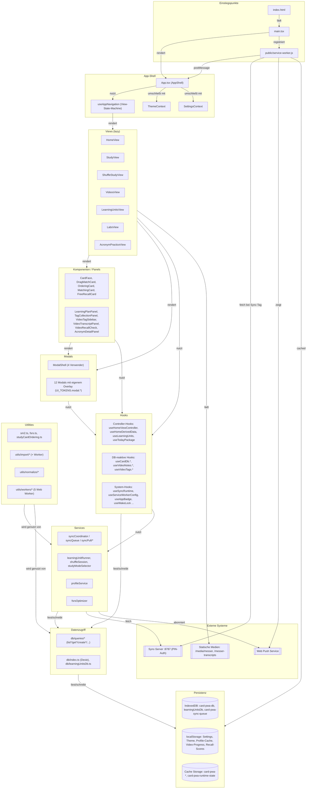

**Legende der Pfeilbedeutung:** „rendert" = JSX-Komposition, „nutzt" = Funktions-/Hook-Aufruf, „liest/schreibt" = Datenzugriff (DB/Storage), „lädt/registriert" = Bootstrap-Vorgang, „fetch/abonniert" = Netzwerkkommunikation.

---

## §2 Klassen- und Komponentendiagramm

### BLATT 02 — Zentrale Komponenten- und Typbeziehungen

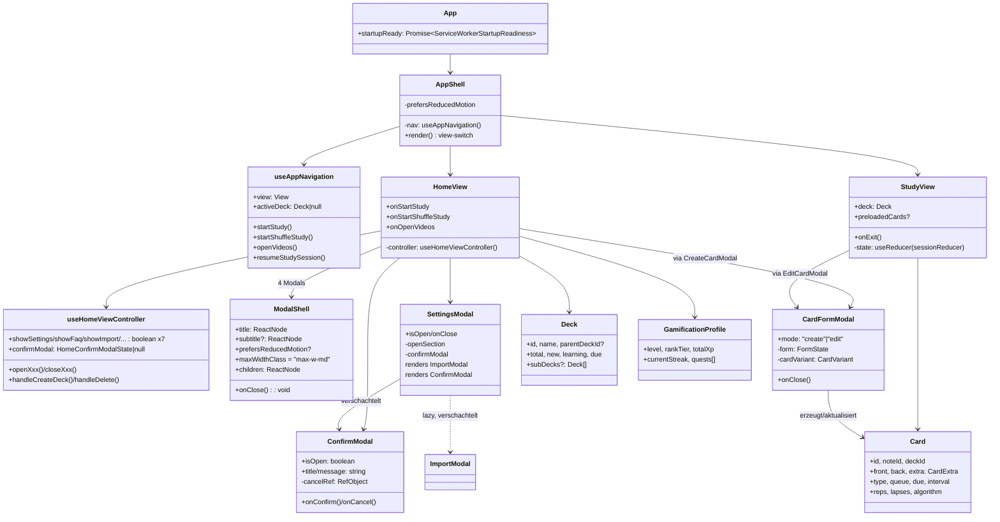

**Hinweis:** Das Diagramm bildet die wichtigsten *strukturellen* Beziehungen ab (Props-Vertrag, Rendering, zentrale Felder); es ersetzt nicht die vollständige Typtabelle in §10 oder die Abhängigkeitstabelle in §18.

---

## §3 Modal-Architektur

Dieses Kapitel ist der Kern des Dossiers (expliziter Analyseschwerpunkt). Alle Aussagen basieren auf vollständiger Lektüre der genannten Dateien.

### §3.1 Aufbau von `ModalShell`

`ModalShell` (`src/components/ModalShell.tsx:1-58`) ist eine reine Präsentationskomponente ohne eigenen State und ohne Hooks außer der Weiterreichung von `prefersReducedMotion` als Prop. Kopfkommentar (Zeile 1–3): *„Shared modal shell for compact app dialogs; centralizes backdrop, motion, header, and close affordance."* — die Selbstbeschreibung deckt sich mit dem Code: Sie zentralisiert ausschließlich **Backdrop, Animation, Header und Schließen-Button**, explizit **nicht** Fokus, Tastatur oder Scroll-Verhalten.

Struktureller Aufbau (Zeilen 30–57):
```
motion.div (Overlay, UI_TOKENS.modal.overlay)
 ├─ div (Backdrop, UI_TOKENS.modal.backdrop, onClick=onClose)
 └─ motion.div (Shell-Container, UI_TOKENS.modal.shell + maxWidthClass + shellClassName)
     ├─ div (Header-Zeile: Titel/Subtitle + Close-Button)
     └─ children (vom Aufrufer übergebener Inhalt)
```

### §3.2 Props und Schnittstellen

`ModalShellProps` (Zeilen 9–18):

| Prop | Typ | Pflicht | Default | Zweck |
|---|---|---|---|---|
| `title` | `ReactNode` | ja | – | Modal-Titel (H3) |
| `subtitle` | `ReactNode` | nein | – | Untertitel unter dem Titel |
| `onClose` | `() => void` | ja | – | Callback für Backdrop-Klick und Close-Button |
| `prefersReducedMotion` | `boolean \| null` | nein | `false` | steuert Animationsvarianten (y-Offset vs. reines Fade) |
| `maxWidthClass` | `string` | nein | `'max-w-md'` | Tailwind-Klasse für Breite |
| `shellClassName` | `string` | nein | `'p-5 sm:p-6'` | zusätzliches Padding/Layout |
| `headerClassName` | `string` | nein | `'mb-4'` | Abstand unter dem Header |
| `children` | `ReactNode` | ja | – | Modal-Inhalt |

Es gibt **keine** Props für: `isOpen` (die Sichtbarkeit wird nicht von `ModalShell` gesteuert — jeder Aufrufer entscheidet selbst per `if (!isOpen) return null`, siehe §3.8), Fokus-Ziel, ARIA-Label, Escape-Verhalten, initiale Scroll-Position, z-Index-Override oder Callback für „nach dem Öffnen"/„nach dem Schließen" (Lifecycle-Hooks).

### §3.3 Interne Funktionsweise

`ModalShell` besitzt keinerlei internen Zustand (`useState`) und keine `useEffect`-Hooks. Die einzige „Logik" ist die bedingte Wahl der Animationswerte in Abhängigkeit von `prefersReducedMotion` (Zeilen 39–42). Sichtbarkeit wird nicht über `AnimatePresence` in `ModalShell` selbst gesteuert — es gibt keinen Exit-Animationsmechanismus *innerhalb* der Komponente. Ob eine Exit-Animation überhaupt abgespielt wird, hängt davon ab, ob der jeweilige Aufrufer `ModalShell` seinerseits in ein `AnimatePresence` einbettet. Aus den vier Verwendern (§3.8) tut dies **keiner** — sie renderen `ModalShell` direkt bedingt (`{isOpen && <ModalShell>...}` bzw. `if (!isOpen) return null`), sodass die in `ModalShell` definierten `exit`-Varianten (Zeilen 34, 41) beim Schließen **nie zur Ausführung kommen**, da das Element sofort aus dem DOM entfernt wird, statt kontrolliert auszublenden. Das ist ein funktionaler Defekt der aktuellen Nutzung: Der Exit-Code existiert, wird aber nie ausgelöst.

### §3.4 Rendering und DOM-Struktur

Kein `createPortal` — `ModalShell` rendert an der Stelle im Komponentenbaum, an der der Aufrufer sie einbindet (typischerweise am Ende der jeweiligen View, siehe z. B. `HomeView.tsx:576-680`). Da die Views selbst als `flex h-full`-Container mit `overflow-hidden`/`overflow-y-auto` aufgebaut sind (siehe `Vollbild-Views: eigener Scroll` im Projektwissen), funktioniert das Fehlen eines Portals nur deshalb unauffällig, weil `UI_TOKENS.modal.overlay` selbst `position: fixed` nutzt (`fixed inset-0 z-[1000] …`, `src/constants/ui.ts:66`) — das Overlay „entkommt" also über CSS `position: fixed`, nicht über die DOM-Hierarchie. Ein `overflow: hidden`/`clip`/`contain`-Vorfahre im Baum könnte dieses Verhalten dennoch brechen (kein Nachweis eines solchen Vorfahren in den geprüften Views, aber architektonisch fragil).

DOM-Struktur konkret für `ModalShell` (aus Header/Body):
```html
<div class="fixed inset-0 z-[1000] flex items-center justify-center px-safe pt-safe-4 pb-4 sm:px-4"> <!-- overlay -->
  <div class="absolute inset-0 bg-black/75"></div> <!-- backdrop -->
  <div class="relative flex min-h-0 w-full max-h-[calc(100dvh-env(safe-area-inset-top,0px)-2rem)] flex-col ds-modal {maxWidthClass} {shellClassName}">
    <div class="flex items-start justify-between gap-3 {headerClassName}">
      <div class="min-w-0"><h3>{title}</h3><p>{subtitle}</p></div>
      <button aria-label="—"><X/></button>
    </div>
    {children}
  </div>
</div>
```
Auffällig: Der Close-Button (Zeile 50–52) trägt **kein** `aria-label` — für Screenreader ist der Button nur über das visuelle X-Icon erkennbar, nicht über einen zugänglichen Namen (im Gegensatz z. B. zu `ConfirmModal.tsx:79`, das `aria-label={t.cancel}` setzt).

### §3.5 Interaktionsabläufe

Einzige interaktive Elemente innerhalb von `ModalShell` selbst: Klick auf Backdrop (Zeile 37, ruft `onClose`) und Klick auf Close-Button (Zeile 50, ruft `onClose`). Beide sind funktional identisch — es gibt keine Unterscheidung zwischen „Abbruch" und „Schließen nach Erfolg". Klicks auf den Inhalt (`children`) werden nicht abgefangen (`e.stopPropagation()` fehlt) — das ist unschädlich, weil der Backdrop als separates Hintergrund-`div` *hinter* dem Shell-Container liegt (kein Klick-Bubbling-Problem zum Backdrop), aber es bedeutet auch, dass `ModalShell` selbst keinerlei Klick-Interzeption für den Inhalt vornimmt; das obliegt vollständig dem Aufrufer.

### §3.6 Fokus- und Tastatursteuerung

`ModalShell` implementiert **keine** Fokussteuerung und **keine** Tastaturbehandlung:
- Kein `autoFocus` auf ein Element beim Öffnen.
- Kein Fokus-Trap (Tab-Zyklus bleibt nicht auf das Modal beschränkt — Tabben kann in den Hintergrund „entkommen").
- Keine Wiederherstellung des Fokus auf das auslösende Element beim Schließen.
- Kein `onKeyDown`-Handler für `Escape`.

Damit hängt das Escape-Verhalten für alle vier `ModalShell`-Verwender vollständig davon ab, ob der jeweilige Aufrufer selbst einen `keydown`-Listener registriert. Keiner der vier tut dies (`InstallHintModal.tsx`, `FutureForecastModal.tsx`, `HomeExportModal.tsx`, `HomeCreateDeckModal.tsx` — keine Fundstelle für `'Escape'` in diesen Dateien, siehe Grep-Beleg in §3.9-Tabelle). **Alle vier über `ModalShell` gebauten Dialoge lassen sich also nicht mit der Escape-Taste schließen.**

### §3.7 Responsive Verhalten

Responsivität kommt ausschließlich aus den `UI_TOKENS.modal`-Klassen, nicht aus `ModalShell`-eigener Logik:
- `overlay`: `px-safe pt-safe-4 pb-4 sm:px-4` — mobile nutzt Safe-Area-Utilities (siehe CLAUDE.md-Konvention), Desktop feste Innenabstände.
- `shell`: `max-h-[calc(100dvh-env(safe-area-inset-top,0px)-2rem)]` — Höhe ist an die dynamische Viewport-Höhe und die obere Safe-Area gekoppelt; kein separates Mobile-/Desktop-Layout (kein Bottom-Sheet-Verhalten wie bei `MobileBottomSheet`).
- `maxWidthClass` (Default `max-w-md`) ist der einzige pro Aufrufer variierbare Breakpoint-Hebel; es gibt keine eingebaute Unterscheidung „Vollbild auf Mobile, zentriert auf Desktop" wie sie z. B. `CardFormModal` (`max-w-none self-end rounded-b-none sm:max-w-lg … sm:rounded-b-[2rem]`, Zeile 374) manuell nachbildet.

### §3.8 Verwender von `ModalShell`

| Datei | Zeilen | Aufrufende Komponente | Besonderheit |
|---|---|---|---|
| `src/components/InstallHintModal.tsx:16-51` | 52 | `HomeView.tsx` (PWA-Installationshinweis) | reine Text-Anzeige, ein Schließen-Button zusätzlich zum ModalShell-eigenen |
| `src/components/FutureForecastModal.tsx:20-128` | 129 | `HomeView.tsx` (Prognose-Diagramm) | rendert ein SVG-loses Balkendiagramm inline; `maxWidthClass="max-w-3xl"` |
| `src/components/home/HomeExportModal.tsx:22-101` | 102 | `HomeView.tsx` (Export-Aktion) | einfaches Formular (Select + 3 Export-Buttons) |
| `src/components/home/HomeCreateDeckModal.tsx:19-78` | 79 | `HomeView.tsx` (Deck anlegen) | einfaches Formular (Input + 2 Buttons), Enter-Taste im Input löst Submit aus (Zeile 47-52) — aber kein Escape auf Modal-Ebene |

Gemeinsames Muster aller vier: `prefersReducedMotion` wird per `useReducedMotion()` selbst geholt (nicht von `App`/View durchgereicht) und 1:1 an `ModalShell` weitergegeben; Sichtbarkeit über `if (!isOpen) return null` **vor** dem Rendern von `ModalShell` (kein `AnimatePresence`-Wrapper beim Aufrufer, siehe §3.3).

### §3.9 Modals ohne `ModalShell`

Alle folgenden Komponenten bauen Overlay/Backdrop/Header/Body/Footer **manuell** nach, meist unter Wiederverwendung derselben `UI_TOKENS.modal.*`-Klassen wie `ModalShell` (`overlay`, `backdrop`, `shell`, `header`, `title`, `subtitle`, `closeButton`, `body`, `footer` — `src/constants/ui.ts:66-76`), aber ohne die Komponente selbst zu importieren:

| Komponente | Datei:Zeilen | Eigenes Overlay | Escape | Fokus | Role/ARIA | Reduced-Motion | Besonderheit |
|---|---|---|---|---|---|---|---|
| `ConfirmModal` | `ConfirmModal.tsx:21-118` | ja (eigenes `motion.div` + `AnimatePresence`) | ja (Zeilen 42-49) | ja — Auto-Fokus auf Cancel-Button (Zeilen 36-40, 100) | `role="dialog"`, `aria-modal`, `aria-labelledby` (Zeilen 64-66) | ja | einziges Modal mit aktivem Fokusmanagement |
| `CardFormModal` (⇒ `CreateCardModal`/`EditCardModal`) | `CardFormModal.tsx:66-749` | ja | nein | nein | nein | ja | größtes Formular-Modal (749 Zeilen); enthält **eigenen, nochmals separat implementierten** Lösch-Bestätigungsdialog inline (Zeilen 709-744) statt `ConfirmModal` zu nutzen; direkter `db.decks…`-Zugriff (Zeile 81) statt Query-Modul |
| `DeckMetricsModal` | `DeckMetricsModal.tsx:13-162` | ja | nein | nein | nein | **nein** (kein `useReducedMotion`-Aufruf) | reine Anzeige, lädt via `getDeckMetricsSnapshot` |
| `DuplicateReviewModal` | `DuplicateReviewModal.tsx:20-221` | **nein** — rendert nur den Shell-`motion.div`, das umgebende Overlay/Backdrop liefert der Aufrufer `ImportModal` | nein (eigenständig) | nein | nein | ja | einzige Komponente, die bewusst *kein* eigenes Overlay hat — funktioniert nur eingebettet |
| `FaqModal` | `FaqModal.tsx:27-236` | ja | nein | nein | nein | ja | nutzt `AccordionSection` für Unterabschnitte |
| `ImportModal` | `ImportModal.tsx:57-376` | ja | ja, aber deaktiviert während `parsing`/`importing` (Zeilen 92-99) | nein | nein | ja | einbettet `DuplicateReviewModal` als „Modal im Modal"-Inhalt (Zeilen 188-206); eigener Drag&Drop-Bereich |
| `SettingsModal` | `SettingsModal.tsx:37-244` | ja (identisch zu `UI_TOKENS.modal.*` nachgebaut, inkl. `header`/`footer` sticky) | ja (Zeilen 46-53) | nein | `role="dialog"`, `aria-modal`, `aria-labelledby` (Zeilen 120-122) | ja | rendert selbst zwei weitere Modals als Kinder: `ImportModal` (lazy, Zeile 35/221-228) und `ConfirmModal` (Zeile 230-241) — verschachteltes Bestätigungsmuster |
| `ShuffleMetricsModal` | `ShuffleMetricsModal.tsx:20-193` | ja | nein | nein | nein | **nein** | analog zu `DeckMetricsModal`, eigener Datensatz (`ShuffleCollection`) |
| `HomeDeckCardsModal` | `home/HomeDeckCardsModal.tsx:22-178` | ja | nein | nein | nein | **nein** | öffnet ihrerseits `EditCardModal`/`CreateCardModal` als gestapeltes zweites Overlay (Zeilen 160-175) — zwei volle `z-[1000]`-Overlays gleichzeitig im DOM |
| `HomeShuffleCollectionModal` | `home/HomeShuffleCollectionModal.tsx:26-277` | ja | nein | nein | nein | ja (Prop von Parent) | größtes Formular nach `CardFormModal`/`ConfirmModal`-Klasse; Live-Neuberechnung der Kartenzahl bei Deck-Auswahl |
| `MobileBottomSheet` | `MobileBottomSheet.tsx:26-63` | ja, **eigenes Layout-Konzept** (Bottom-Sheet statt zentriertes Modal, `z-[190]`/`z-[200]` statt `z-[1000]`) | nein | nein | `role="dialog"`, `aria-modal`, `aria-label` (Zeilen 52-54) | nein (kein reduced-motion-Handling für den Spring) | Drag-to-dismiss (`dragConstraints`/`onDragEnd`, Zeilen 46-51); nur `sm:hidden` (mobil-exklusiv) |

Zusätzlich existieren **6 vollflächige Overlay-„Panels"** außerhalb der `components/`-Wurzel, die architektonisch ebenfalls Modals sind (eigenes `fixed inset-0`, `role="dialog"`, `onClose`-Callback), aber komplett eigenständig implementiert:

| Komponente | Datei:Zeilen | z-Index | Portal | Escape | Aufrufer |
|---|---|---|---|---|---|
| `LearningPlanPanel` | `LearningPlanPanel.tsx:293-460, 801-821` | `z-[9999]` | ja, `createPortal` (Zeile 9, 801) | ja, inkl. „ungespeicherte Änderungen"-Guard (Zeilen 419-460: `dirty`-Check vor Schließen) | `LearningUnitsView.tsx:522` |
| `AcronymDetailPanel` | `acronyms/AcronymDetailPanel.tsx:33-89` | `z-[100]` | ja, `createPortal` (Zeile 7, 38) | nein | `AcronymPracticeView.tsx` |
| `TagCollectionPanel` | `videos/TagCollectionPanel.tsx:104-514` | `z-[70]` | nein | nein | `VideosView.tsx` |
| `VideoTagSidebar` | `videos/VideoTagSidebar.tsx:117-257` | `z-[60]` | nein | nein | `VideosView.tsx` |
| `VideoTranscriptPanel` | `videos/VideoTranscriptPanel.tsx:33-96` | `z-[60]` | nein | nein | `VideosView.tsx` |
| `VideoRecallCheck` | `videos/VideoRecallCheck.tsx:124-773` | `z-[60]` | nein | nein | `VideosView.tsx` |

`LearningPlanPanel` ist damit die architektonisch **anspruchsvollste** Modal-Implementierung der App (Portal, Escape mit Dirty-Guard, `role="dialog"`) — sie teilt aber keinerlei Code mit `ModalShell` oder den anderen Overlays.

### §3.10 Inkonsistenzen und Duplikationen (Zusammenfassung)

1. **Z-Index-Kollisionsrisiko.** Belegte Werte im Projekt: `z-[60]`, `z-[70]`, `z-[90]` (sticky Toolbar, kein Overlay), `z-[100]`, `z-[110]` (`UpdateBanner.tsx:23`), `z-[190]`/`z-[200]` (`MobileBottomSheet`), `z-[1000]` (`UI_TOKENS.modal.overlay`), `z-[1100]` (Dropdown-Menü `DeckCard.tsx:141`), `z-[1300]` (Dropdown-Menüs `HomeDeckToolbar.tsx:204,398`), `z-[2200]` (Splash, `App.tsx:406`), `z-[9999]` (`LearningPlanPanel`). Ein Dropdown-Kontextmenü (`1100`/`1300`) liegt damit über jedem regulären Modal (`1000`) — öffnet ein Nutzer ein Modal während ein Kontextmenü sichtbar ist (oder umgekehrt), ist die Stapelreihenfolge nicht durch ein einheitliches Konzept, sondern durch zufällige Literalwerte bestimmt. Es gibt **keine zentrale Z-Index-Skala** (nicht in `tailwind.config.js`, nicht in `UI_TOKENS`).
2. **Doppelte Bestätigungsdialog-Implementierung.** `ConfirmModal` existiert als wiederverwendbare Komponente, wird aber in `CardFormModal.tsx:709-744` für den Karten-Löschvorgang **nicht** verwendet — dort ist ein strukturell nahezu identischer, aber eigenständig gestylter Bestätigungsdialog inline codiert.
3. **Uneinheitliches Reduced-Motion-Handling.** `DeckMetricsModal`, `ShuffleMetricsModal`, `HomeDeckCardsModal` und `MobileBottomSheet` respektieren `prefers-reduced-motion` nicht (kein `useReducedMotion()`-Aufruf), während die übrigen 12 Komponenten dies tun.
4. **Uneinheitliche Escape-Behandlung.** Nur 3 von 16 kompakten Modals (`ConfirmModal`, `SettingsModal`, `ImportModal`) sowie 1 von 6 Panels (`LearningPlanPanel`) schließen auf Escape. Die 4 `ModalShell`-Nutzer schließen **nicht** auf Escape, obwohl sie sich optisch nicht von den anderen unterscheiden.
5. **Uneinheitliches Fokusmanagement.** Nur `ConfirmModal` setzt beim Öffnen aktiv Fokus; kein Modal implementiert einen echten Fokus-Trap; keines stellt den Fokus beim Schließen wieder her.
6. **Kein Scroll-Lock.** Kein einziges Modal (weder `ModalShell` noch die manuellen Implementierungen) sperrt `document.body`-Scroll beim Öffnen. Der einzige Fund von `document.body.style.overflow` im gesamten `src/`-Baum betrifft `VideosView.tsx:262-265` (Vollbild-Videoplayer, kein „Modal" im engeren Sinn). Hintergrund-Scroll unter einem offenen Modal ist damit möglich, sofern das darunterliegende Layout selbst scrollt.
7. **ARIA-Lücke.** 10 von 22 Overlay-Komponenten setzen sowohl `role="dialog"` als auch `aria-modal` (`ConfirmModal`, `SettingsModal`, `MobileBottomSheet`, `VideosView`, `VideoTranscriptPanel`, `VideoTagSidebar`, `TagCollectionPanel`, `VideoRecallCheck`, `AcronymDetailPanel`, `LearningPlanPanel`). Nur 3 davon verbinden den sichtbaren Titel zusätzlich per `aria-labelledby` (`ConfirmModal`, `SettingsModal`, `LearningPlanPanel`). `ModalShell` selbst und alle vier seiner Verwender **fehlt** jegliches ARIA-Rollen-Attribut.
8. **Verschachtelte Modals ohne Verwaltungskonzept.** Mehrere Stellen stapeln zwei volle Overlays gleichzeitig im DOM, ohne dass ein übergeordneter Mechanismus die Stapelreihenfolge, Fokusübergabe oder ein „nur ein Modal gleichzeitig"-Invariante erzwingt: `SettingsModal` → `ImportModal`/`ConfirmModal` (`SettingsModal.tsx:221-241`), `HomeDeckCardsModal` → `EditCardModal`/`CreateCardModal` (`HomeDeckCardsModal.tsx:160-175`), `ImportModal` → `DuplicateReviewModal` (`ImportModal.tsx:188-206`).
9. **Direkter DB-Zugriff aus einer Modal-Komponente.** `CardFormModal.tsx:81` (`db.decks.orderBy('name').toArray()`) umgeht die Query-Schicht (`db/queries/decks.ts`) und greift direkt auf das Dexie-Objekt zu — ein Schichtverletzungs-Befund (siehe auch §15).
10. **Migrationsaufwand pro Modal auf `ModalShell`** (grobe Einschätzung nach Komplexität):

| Modal | Migrationsaufwand | Begründung |
|---|---|---|
| `DeckMetricsModal`, `ShuffleMetricsModal`, `HomeDeckCardsModal`, `HomeShuffleCollectionModal`, `FaqModal` | **niedrig** | nutzen bereits identische `UI_TOKENS.modal.*`-Klassen; reines Markup-Ersetzen |
| `ImportModal`, `DuplicateReviewModal` | **mittel** | eingebettetes Modal-im-Modal-Muster (Konflikt-Review) müsste als Slot/Sub-Zustand modelliert werden |
| `SettingsModal` | **mittel–hoch** | eigene sticky Header/Footer-Struktur, verschachtelte `ImportModal`/`ConfirmModal`-Aufrufe, viel Eigenzustand — Migration nur der Hülle, nicht der Sektionen |
| `CardFormModal` | **hoch** | inline-Löschdialog müsste durch `ConfirmModal` ersetzt werden, abweichendes Footer-Layout, Bottom-Sheet-Verhalten auf Mobile (`self-end rounded-b-none`) müsste in `ModalShell` nachgebildet werden |
| `ConfirmModal` | **hoch (bewusst getrennt halten empfohlen)** | Fokusmanagement/Escape sind hier vorbildlich — eher Kandidat, um `ModalShell` um diese Fähigkeiten zu *erweitern*, als selbst zu migrieren |
| `MobileBottomSheet` | **konzeptionell inkompatibel** | anderes Interaktionsmodell (Bottom-Sheet, Drag-to-dismiss); sollte eigenständig bleiben oder eigene Shell-Variante erhalten |
| Video-Panels (`TagCollectionPanel`, `VideoTagSidebar`, `VideoTranscriptPanel`, `VideoRecallCheck`), `AcronymDetailPanel`, `LearningPlanPanel` | **hoch / eigene Kategorie** | Vollbild statt zentriertes Dialog-Layout, teils mit Portal — passen konzeptionell nicht in die kompakte `ModalShell`, eher eigene „FullscreenPanelShell"-Abstraktion (siehe §20) |

### §3.11 Empfohlene Zielarchitektur (Kurzfassung)

Ausführlich in §20. Kernaussage: Die App braucht ein verbindliches Overlay-Primitive für Dialog, AlertDialog, Sheet und FullscreenPanel. Dieses Primitive sollte Tastaturverhalten, Fokusinitialisierung/-Rückgabe, Hintergrund-Inertheit, ARIA-Grundstruktur, optionalen Scroll-Lock und ein Top-Layer-/Portal-Konzept zentral absichern, bevor weitere Modals nur visuell auf `ModalShell` migriert werden. Eine Migration auf die aktuelle `ModalShell` würde lediglich Markup-Duplikation reduzieren, aber die eigentlichen Interaktions- und Accessibility-Lücken nicht schließen.

---

### BLATT 03 — Modal-Matrix (Ist-Zustand)

| Modal | Definiert in | Geöffnet von | Verwendet ModalShell | Eigenes Overlay | Fokusmanagement | Escape | Backdrop Close | Scroll Lock | Besonderheiten |
|---|---|---|---|---|---|---|---|---|---|
| InstallHintModal | `components/InstallHintModal.tsx` | `HomeView.tsx` | ✅ | – | ❌ | ❌ | ✅ | ❌ | reiner Hinweistext |
| FutureForecastModal | `components/FutureForecastModal.tsx` | `HomeView.tsx` | ✅ | – | ❌ | ❌ | ✅ | ❌ | Prognose-Balkendiagramm inline |
| HomeExportModal | `components/home/HomeExportModal.tsx` | `HomeView.tsx` | ✅ | – | ❌ | ❌ | ✅ | ❌ | 3 Export-Formate |
| HomeCreateDeckModal | `components/home/HomeCreateDeckModal.tsx` | `HomeView.tsx` | ✅ | – | ❌ | ❌ | ✅ | ❌ | Enter-Submit im Input |
| ConfirmModal | `components/ConfirmModal.tsx` | `HomeView`, `ProfileSyncSection`, `SettingsModal` | ❌ | ✅ | ✅ (Auto-Fokus Cancel) | ✅ | ✅ | ❌ | einziges Modal mit Fokusmanagement; `role="dialog"` |
| CardFormModal (→ CreateCardModal/EditCardModal) | `components/CardFormModal.tsx` | `HomeView`, `StudyView`, `ShuffleStudyView`, `HomeDeckCardsModal` | ❌ | ✅ | ❌ | ❌ | ✅ | ❌ | inline Lösch-Dialog dupliziert `ConfirmModal`; direkter `db.decks`-Zugriff |
| DeckMetricsModal | `components/DeckMetricsModal.tsx` | `HomeView.tsx` | ❌ | ✅ | ❌ | ❌ | ✅ | ❌ | kein Reduced-Motion |
| DuplicateReviewModal | `components/DuplicateReviewModal.tsx` | `ImportModal.tsx` | ❌ | ❌ (nutzt Overlay des Aufrufers) | ❌ | ❌ (eigenständig) | – | ❌ | „Modal ohne eigenes Overlay" |
| FaqModal | `components/FaqModal.tsx` | `HomeView.tsx` | ❌ | ✅ | ❌ | ❌ | ✅ | ❌ | nutzt `AccordionSection` |
| ImportModal | `components/ImportModal.tsx` | `HomeView`, `SettingsModal` | ❌ | ✅ | ❌ | ✅ (deaktiviert während Verarbeitung) | ✅ (deaktiviert während Verarbeitung) | ❌ | bettet `DuplicateReviewModal` ein |
| SettingsModal | `components/SettingsModal.tsx` | `HomeView.tsx` | ❌ | ✅ (`UI_TOKENS`-Nachbau) | ❌ | ✅ | ✅ | ❌ | öffnet verschachtelt `ImportModal`+`ConfirmModal` |
| ShuffleMetricsModal | `components/ShuffleMetricsModal.tsx` | `HomeView.tsx` | ❌ | ✅ | ❌ | ❌ | ✅ | ❌ | kein Reduced-Motion |
| HomeDeckCardsModal | `components/home/HomeDeckCardsModal.tsx` | `HomeView.tsx` | ❌ | ✅ | ❌ | ❌ | ✅ | ❌ | öffnet gestapelt `EditCardModal`/`CreateCardModal`; kein Reduced-Motion |
| HomeShuffleCollectionModal | `components/home/HomeShuffleCollectionModal.tsx` | `HomeView.tsx` | ❌ | ✅ | ❌ | ❌ | ✅ | ❌ | Live-Kartenzahl-Neuberechnung |
| MobileBottomSheet | `components/MobileBottomSheet.tsx` | `home/HomeBottomBar.tsx` | ❌ | ✅ (Bottom-Sheet, eigenes z-Schema) | ❌ | ❌ | ✅ (Klick) + Drag-Dismiss | ❌ | einziges Drag-to-dismiss-Muster |
| LearningPlanPanel | `components/LearningPlanPanel.tsx` | `LearningUnitsView.tsx` | ❌ | ✅ (Portal, `z-[9999]`) | teilweise (Dirty-Guard) | ✅ (mit Dirty-Check) | ✅ | ❌ | einziges Panel mit `createPortal` + Escape-Guard |
| AcronymDetailPanel | `components/acronyms/AcronymDetailPanel.tsx` | `AcronymPracticeView.tsx` | ❌ | ✅ (Portal, `z-[100]`) | ❌ | ❌ | ✅ | ❌ | Vollbild, `createPortal` |
| TagCollectionPanel | `components/videos/TagCollectionPanel.tsx` | `VideosView.tsx` | ❌ | ✅ (`z-[70]`) | ❌ | ❌ | ✅ | ❌ | Vollbild Tag-Sammlung |
| VideoTagSidebar | `components/videos/VideoTagSidebar.tsx` | `VideosView.tsx` | ❌ | ✅ (`z-[60]`) | ❌ | ❌ | ✅ | ❌ | Sheet-/Panel-Variante konfigurierbar |
| VideoTranscriptPanel | `components/videos/VideoTranscriptPanel.tsx` | `VideosView.tsx` | ❌ | ✅ (`z-[60]`) | ❌ | ❌ | ✅ | ❌ | Vollbild Transkript |
| VideoRecallCheck | `components/videos/VideoRecallCheck.tsx` | `VideosView.tsx` | ❌ | ✅ (`z-[60]`) | ❌ | ❌ | ✅ | ❌ | Vollbild Selbsteinschätzung (kein FSRS-Scheduling, siehe Projektwissen) |

**Bewertung (vorweggenommen aus §19):** `ModalShell` ist **keine** durchgesetzte zentrale Abstraktion, sondern wird nur punktuell (4 von 22 Overlay-Komponenten, ≈18 %) verwendet. Die eigentliche Vereinheitlichung im Projekt erfolgt über gemeinsame CSS-Klassen (`UI_TOKENS.modal`), die aber **ohne** Komponentenkapselung keine gemeinsame Verhaltenslogik (Escape/Fokus/Scroll-Lock/ARIA) erzwingen können — das erklärt, warum diese Aspekte über alle 22 Komponenten hinweg uneinheitlich implementiert sind.

---

## §4 Datenflussdiagramme

Alle Datenflüsse sind am Beispiel des vollständigsten Formular-Modals (`CardFormModal`, Modus `create`) sowie – wo abweichend – anhand von `HomeShuffleCollectionModal`/`ImportModal` dokumentiert, weil diese die einzigen Modals mit echtem DB-Schreibzugriff **und** Sync-Enqueue sind.

### BLATT 04A — Modal öffnen → Formular bearbeiten → Speichern → Persistenz → View-Update → Schließen

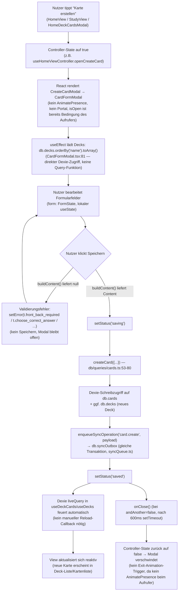

### BLATT 04B — Fehlerfall und Abbruch ohne Speichern

```mermaid
flowchart TD
    S["Formular offen, Nutzer hat Änderungen vorgenommen"] --> T{"Aktion?"}
    T -->|"Klick auf Backdrop / X-Button"| U["onClose() direkt\n— KEIN Dirty-Check, KEINE Rückfrage\n(Ausnahme: LearningPlanPanel prüft 'dirty', §3.9)"]
    U --> V["Eingaben gehen verloren, kein DB-Zugriff erfolgte"]
    T -->|"Klick auf Speichern, aber createCard/updateCard liefert {ok:false}"| W["setError(result.error ?? t.unknown_error)\nsetStatus('error')"]
    W --> X["Modal bleibt offen, Nutzer kann erneut versuchen\noder Backdrop/X klicken (→ U)"]
    T -->|"Klick auf Löschen (nur edit-Modus)"| Y["setShowDeleteConfirm(true)\n— eigener, inline codierter Bestätigungsdialog\n(CardFormModal.tsx:709-744, KEIN ConfirmModal)"]
    Y --> Z{"Bestätigt?"}
    Z -->|"Nein"| U
    Z -->|"Ja"| AA["deleteCard(id) → db.cards.delete + enqueueSyncOperation('card.delete')"]
    AA --> AB["onDeleted?.() Callback an Aufrufer (z.B. reload())"]
    AB --> AC["onClose()"]
```

**Validierung** erfolgt ausschließlich client-seitig und synchron in `buildContent()` (`CardFormModal.tsx:230-266`) — keine serverseitige Validierung vor dem lokalen Schreiben; Konsistenzprüfungen (Reps-Regel, Konfliktauflösung) passieren erst später beim Sync-Pull (`syncPull/apply.ts`, siehe §4C).

### BLATT 04C — Sync-Datenfluss (Persistenz bis zum Sync-Server und zurück)

```mermaid
flowchart LR
    A["Lokale Mutation\n(z.B. createCard, recordReview)"] --> B["Dexie-Transaktion:\nFachtabelle + db.syncOutbox\n(ATOMAR, reviews.ts:561-578)"]
    B --> C["syncQueue.drainTransactionalOutbox()\nüberführt Outbox → eigene Dexie-DB card-pwa-sync-queue"]
    C --> D{"syncCoordinator.runSyncCycleNow()\nisSyncActive() && reachable?"}
    D -->|"nein"| E["Operation bleibt in Queue,\nnächster Trigger (online/visibilitychange/Intervall)"]
    D -->|"ja"| F["flushSyncQueue(): POST {endpoint}/sync\nje Operation, X-Idempotency-Key=opId"]
    F --> G["Server verarbeitet Operation"]
    F -->|"Queue nach Flush leer"| H["pullAndApplySyncDeltas()"]
    H --> I["GET /pull?since=cursor&clientId=..."]
    I --> J["utils/sync/operationResolver.resolveOperations()\n(optional im Web Worker sync-applier.worker.ts)"]
    J --> K["syncPull/apply.ts: Reps-First-Regel,\nLast-Write-Wins, progress.reset-Sonderfall"]
    K --> L["Dexie-Schreiben in decks/cards/reviews/\nshuffleCollections/videoNotes2"]
    L --> M["Dexie liveQuery feuert →\nHooks (useDecks, useDeckCards, ...) aktualisieren betroffene Views"]
```

---

## §5 Ablaufdiagramme zentraler Anwendungsfälle

### BLATT 05.1 — Modal öffnen und schließen (`ModalShell`-Fall, z. B. `HomeCreateDeckModal`)

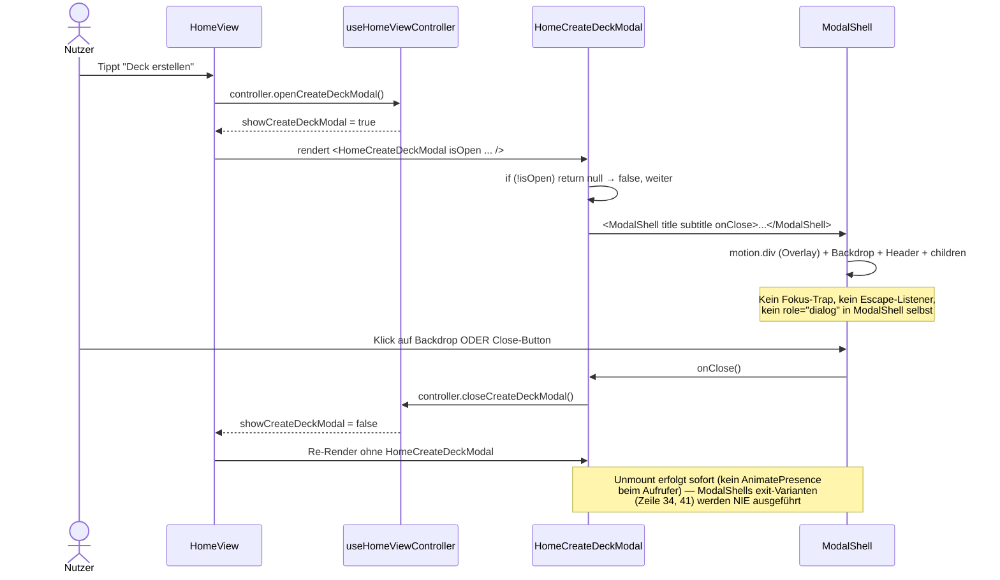

### BLATT 05.2 — Formular-Modal öffnen, Daten ändern, speichern (`CardFormModal`, Modus create)

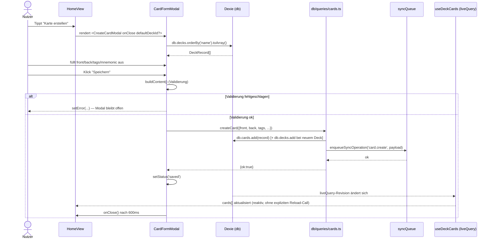

### BLATT 05.3 — Modal über Escape oder Backdrop schließen (`SettingsModal`)

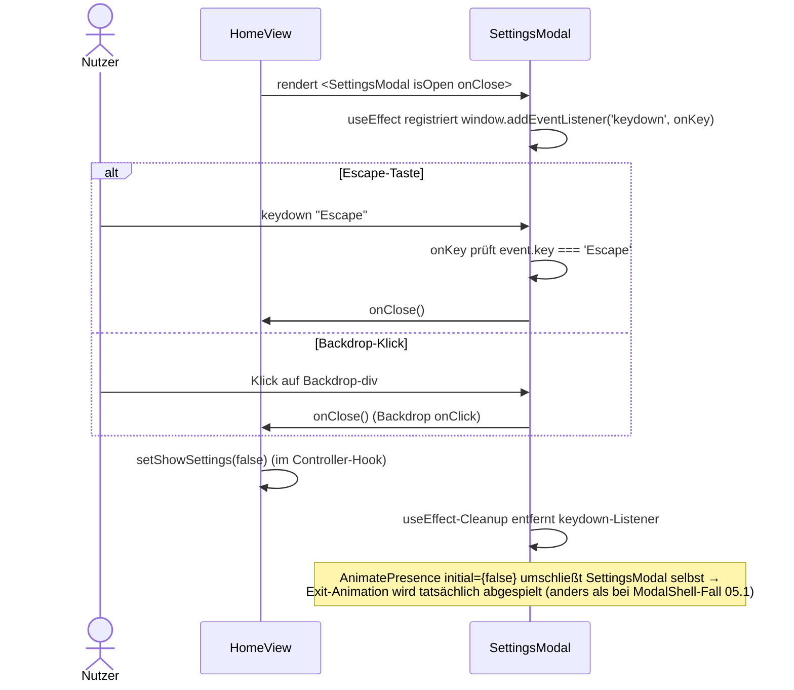

### BLATT 05.4 — Verschachteltes Bestätigungsmodal (`SettingsModal` → `ConfirmModal`)

```mermaid
sequenceDiagram
    actor U as Nutzer
    participant SM as SettingsModal
    participant SDS as SettingsDataSection
    participant CM as ConfirmModal

    U->>SDS: Klick "Lokale Daten löschen"
    SDS->>SM: setConfirmModal({title, message, variant:'danger', onConfirm})
    SM->>CM: rendert <ConfirmModal isOpen=true .../> (zweites Overlay, gestapelt über SettingsModal)
    CM->>CM: useEffect: cancelRef.current?.focus() (Auto-Fokus Abbrechen-Button)
    CM->>CM: useEffect registriert eigenen Escape-Listener
    alt Nutzer bestätigt
        U->>CM: Klick "Löschen"
        CM->>SM: onConfirm() → confirmModal.onConfirm() ausgeführt + setConfirmModal(null)
        SM->>SM: eigentliche Löschroutine läuft (außerhalb dieses Diagramms)
    else Nutzer bricht ab
        U->>CM: Escape ODER Backdrop-Klick ODER "Abbrechen"
        CM->>SM: onCancel() → setConfirmModal(null)
    end
    Note over SM,CM: Zwei volle z-[1000]-Overlays gleichzeitig im DOM;<br/>kein zentraler Modal-Stack verwaltet die Reihenfolge (§3.10)
```

### BLATT 05.5 — Datenänderung vom Modal bis zur Persistenz (Deck-Erstellung, ohne Sync-Enqueue — Gegenbeispiel)

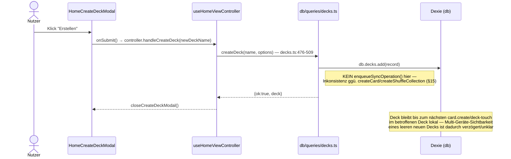

### BLATT 05.6 — App-Start und Navigation zu einer View

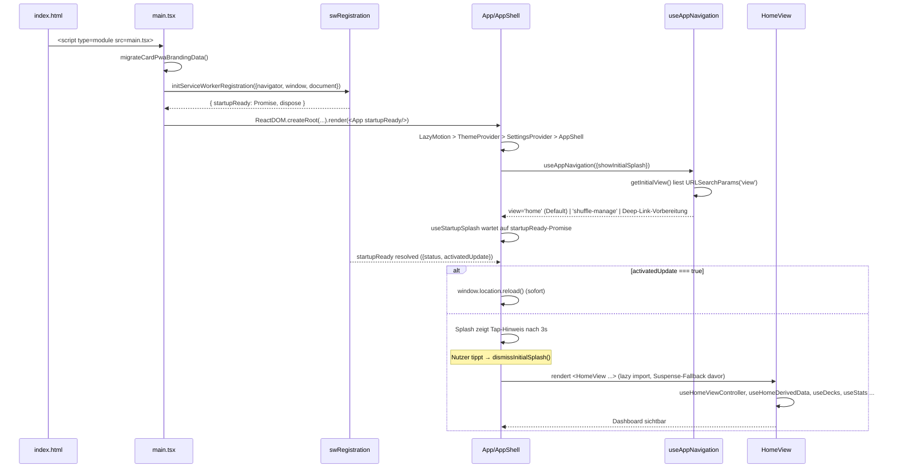

### BLATT 05.7 — Zentraler fachlicher Ablauf: Karte bewerten (Review) bis Sync

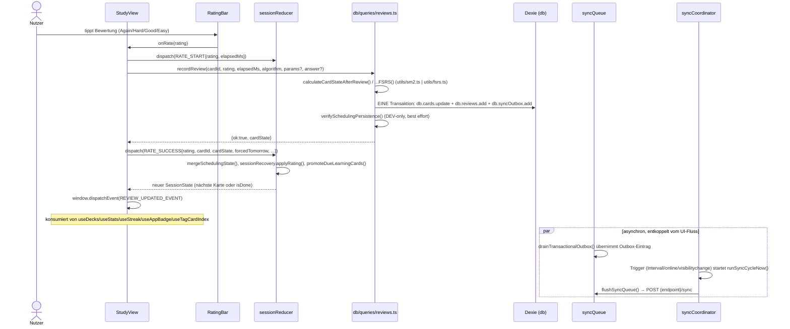

---

## §6 Einstiegspunkte der Anwendung

**HTML-Einstieg** (`index.html:1-32`): lädt `src/main.tsx` als ES-Modul; verzichtet bewusst auf Apple-Legacy-Metas (`apple-mobile-web-app-capable` u. ä. fehlen absichtlich, CLAUDE.md-Kontrakt) und auf externe render-blockierende Ressourcen — Fonts werden selbst gehostet und vorab per `<link rel="preload">` geladen (Zeilen 24-27), `theme-color` ist hart auf `#000000` gesetzt (Zeile 10).

**React-Bootstrap** (`main.tsx:16-42`): `bootstrap()` läuft asynchron vor dem ersten Render — zuerst `migrateCardPwaBrandingData()` (Altlasten-Migration, `services/brandMigration`), danach `initServiceWorkerRegistration(...)` mit injizierten `navigator`/`window`/`document`-Referenzen (testbar ohne echten Browser), erst danach `ReactDOM.createRoot(...).render(<App startupReady={swRuntime.startupReady}/>)` innerhalb von `React.StrictMode`. `import.meta.hot.dispose` räumt bei Vite-HMR die SW-Registrierung sauber ab (Zeilen 36-41).

**Provider-Kette** (`App.tsx:428-436`): `LazyMotion features={loadMotionFeatures}` → `ThemeProvider` → `SettingsProvider` → `AppShell`. `loadMotionFeatures` lädt `ui/motionFeatures.ts` (Export `domMax`, wegen Drag-Gesten in `DragMatchCard`) als eigenen Chunk nach.

**App-Initialisierung** (`AppShell`, `App.tsx:236-330` + `AppInitializer.tsx`): `AppShell` verdrahtet `useViewportCssVars`, `useAutoJoinDefaultProfile`, `useFullscreenPreference`, `useStartupSplash`, `useAppNavigation`, `useServiceWorkerUpdateFlow`; `AppInitializer` (als Kind-Wrapper) bündelt die reinen Seiteneffekt-Hooks ohne eigenes UI: `useStoragePersistence`, `useAppBadge`, `useAlgorithmMigration`, `useBacklogSmoother`, `useGlobalErrorLogging`, `useSyncRuntime(isProfileHydrated)`, `useServiceWorkerConfig`, `useWebPushSubscription`, plus (nur `import.meta.env.DEV`) einen Diagnose-`db.open()`-Aufruf und `ensureCompTIA701DeckHierarchy()`.

**Routing/View-State-Machine:** kein Router; `useAppNavigation()` (`hooks/app/useAppNavigation.ts`) hält `view: 'home'|'study'|'shuffle-study'|'shuffle-manage'|'videos'` in `useState` und stellt ~15 Übergangsfunktionen bereit (`startStudy`, `startTagStudy`, `startDailyQuest`, `startObjectiveStudy`, `resumeStudySession`, `startShuffleStudy`, `openShuffleManager`, `openVideos`, `openVideoAtIndex`, `goHome`, `exitVideos`, `exitStudy`, …).

**Service Worker:** `public/service-worker.js` (1.559 Zeilen, handgeschrieben, kein Workbox-Output). Zwei Caches (`card-pwa-<version>` für App-Shell/Assets, `card-pwa-runtime-state` als Key-Value-Zweitverwendung für Reminder-/KPI-/Session-/Reachability-State). Fetch-Strategien differenziert nach Ressourcentyp: `navigationNetworkFirst` (Dokumente, mit 1500 ms-Timeout und persistiertem Reachability-Fastpath), `cacheFirst` (`/assets/*`, Vite-content-hashed), `staleWhileRevalidate` (sonstige Assets), `networkFirst` (Rest); `/media/*`, Video-Requests und `/health`/`/auth*`/`/sync*` werden bewusst **nicht** abgefangen. Voll ausgebauter Web-Push-Handler inkl. eigener Motivations-Textbausteine (als Duplikat aus `card-sync-server/server/push/motivation.py` generiert) sowie ein autonomer SW-seitiger Sync-Queue-Flush über rohes `indexedDB.open` (ohne Dexie), der aktiven Tabs den Vortritt lässt.

**Query-Parameter und Deep-Links:** `?view=study` (Schnellstart Tagesquest/Resume, `isQuickStudyRequested`), `?view=import` (öffnet ImportModal; zusätzlich in `sessionStorage` unter dem Key aus `STORAGE_KEYS.pendingImportRequest` gemerkt, falls ein SW-Update-Reload den Query-Parameter vorher entfernt), `?view=shuffle`/`?view=shuffle-manage` (Startansicht `shuffle-manage`), `?safeAreaDebug=1|0` (`App.tsx:57-70`, persistiert Debug-Overlay-Flag in `localStorage['card-pwa-safe-area-debug']`). Zusätzlich reagiert die App auf die File-Handler-API (`window.launchQueue`, Chromium) für per Betriebssystem geöffnete `.apkg`/`.csv`-Dateien (`manifest.json` `file_handlers`, Zeilen 54-62) sowie auf `manifest.json`-`shortcuts` (Zeilen 63-90).

**Globale Initialisierungen:** CSS-Variablen für Viewport-Höhe/Safe-Area (`useViewportCssVars`, `App.tsx:71-118`), Theme-CSS-Variablen (`ThemeContext`-Effekt, ~35 Custom Properties plus `data-theme`-Attribut und `neo-app`-Klasse auf `document.body`), Settings-Hydration mit anschließendem `EXAM_DATE_SYNCED_EVENT`-Listener für außerhalb-React geschriebene Sync-Werte.

---

## §7 Verzeichnis- und Modulstruktur

| Verzeichnis | Anzahl Dateien | Inhalt | Wichtigste Module | Architektonische Rolle |
|---|---|---|---|---|
| `src/` (Wurzel) | 8 | `App.tsx`, `main.tsx`, `i18n.ts`, `env.ts`, `index.css`, `vite-env.d.ts` | `App.tsx`, `main.tsx`, `i18n.ts` (1.061 Z. STRINGS-Katalog) | Einstiegspunkt + globales Stylesheet |
| `src/components/` (Wurzel) | ≈52 | Vollbild-Views, kompakte Modals, Karten-Renderer, Layout-Bausteine | `HomeView`, `StudyView`, `ShuffleStudyView`, `ModalShell`, `CardFormModal`, `SettingsModal`, `AppInitializer`, `AppErrorBoundary` | Präsentationsschicht (Views + Modals + gemeinsame UI) |
| `src/components/home/` | 15 | Home-Dashboard-Bausteine (Sections, Tiles, Modals, Toolbar) | `HomeDeckListSection`, `HomeShuffleSection`, `HomeDeckToolbar`, `HomeCreateDeckModal`, `HomeDeckCardsModal` | Feature-Unterordner für die Startansicht |
| `src/components/videos/` | 12 | Video-Player, Panels, Studybar, Download-Steuerung | `VideosView`, `MesserVideoPlayer`, `VideoRecallCheck`, `TagCollectionPanel`, `VideoTagSidebar` | Feature-Unterordner Video-Lernen (Vollbild-Overlays statt Modals) |
| `src/components/settings/` | 8 | Ausgelagerte Sektionen von `SettingsModal` | `SettingsProfileSyncSection`, `SettingsDataSection`, `SettingsNotificationsSection`, `useNotificationPermissionFlow.ts` | Modul-Aufteilung eines großen Modals nach Sektionen |
| `src/components/labs/` | 3 | Interaktive Sicherheitsszenarien (Ordering/Matching-Übungen) | `LabsView`, `LabScenarioView`, `labUi.tsx` | Feature-Unterordner Labs |
| `src/components/acronyms/` | 2 | Akronym-Übungsmodus | `AcronymPracticeView`, `AcronymDetailPanel` | Feature-Unterordner Akronyme |
| `src/hooks/` (Wurzel) | 28 | App-weite Custom Hooks (DB-reaktiv, System/Browser-APIs) | `useCardDb.ts`, `useSyncRuntime.ts`, `useVideoNotes.ts`, `useVideoTags.ts`, `useVideoRecallScores.ts` | Vermittlungsschicht Komponenten ↔ Daten/Browser-APIs |
| `src/hooks/app/` | 3 | App-Shell-spezifische Hooks | `useAppNavigation.ts`, `useServiceWorkerUpdateFlow.ts`, `useStartupSplash.ts` | Navigations-/Update-Steuerung der Shell |
| `src/hooks/home/` | 7 | Home-Dashboard-Controller-Hooks | `useHomeViewController.ts` (God Hook, 363 Z.), `useHomeDerivedData.ts`, `useLearningUnits.ts`, `useTodayPackage.ts` | Fachlogik-Bündelung für HomeView |
| `src/hooks/videos/` | 4 | Video-View-spezifische Hooks | `useVideoTagPanels.ts`, `useVideoWritingMode.ts`, `usePersistentBool.ts` | Kleinteilige UI-State-Hooks für VideosView |
| `src/services/` (Wurzel) | 19 | Fachliche Dienste ohne React-Abhängigkeit | `syncCoordinator.ts`, `syncQueue.ts`, `profileService.ts`, `learningUnitRunner.ts`, `shuffleSession.ts` | Service-Schicht zwischen Hooks und DB/Netzwerk |
| `src/services/syncPull/` | 7 | Sync-Empfangspfad (Handshake/Snapshot/Delta) | `handshake.ts`, `snapshot.ts`, `deltaPull.ts`, `apply.ts`, `bootstrapUpload.ts` | Sync-Client-Subsystem |
| `src/db/` (Wurzel) | 3 | Dexie-Datenbankdefinitionen | `index.ts`, `learningUnitsDb.ts`, `queries.ts` | Persistenzdefinition |
| `src/db/queries/` | 14 | Nach Fachlichkeit gruppierte Query-Module | `cards.ts`, `decks.ts`, `reviews.ts` (837 Z.), `learningUnits.ts` (1.116 Z., größtes Query-Modul), `gamification.ts` | Datenzugriffsschicht (Verb-Vertrag: `list*/get*/create*/...`) |
| `src/utils/` (Wurzel) | 43 | Reine Funktionen: Scheduling, Text-Parsing, Statistik, Backup, Video-Utilities | `sm2.ts`, `fsrs.ts`, `cardTextParser.ts`, `learningUnits.ts` (887 Z.), `dbBackup.ts` (426 Z.) | Fachliche Kernlogik ohne I/O-Kopplung |
| `src/utils/import/` | 10 | Anki/CSV/JSON-Import-Pipeline | `importPipeline.ts`, `apkgImporter.ts`, `csvImporter.ts` (619 Z.), `ankiDatabase.ts` | Import-Subsystem |
| `src/utils/normalize/` | 6 | Normalisierung externer/Sync-Payloads | `card.ts`, `snapshot.ts`, `videoNote.ts` | Grenzschicht Sync ↔ interne Records |
| `src/utils/workers/` | 7 | Web-Worker + Pool-Infrastruktur | `workerPool.ts`, `stats.worker.ts`, `apkg-parser.worker.ts`, `sync-applier.worker.ts` | Off-Thread-Rechenlast |
| `src/utils/stats/`, `src/utils/sync/` | 1 + 1 | Aggregation bzw. Sync-Operation-Resolver | `stats/aggregate.ts`, `sync/operationResolver.ts` | Spezialisierte Utility-Einzelmodule |
| `src/contexts/` | 2 | React-Contexts | `ThemeContext.tsx`, `SettingsContext.tsx` | App-weiter Konfigurations-/Theme-Zustand |
| `src/data/` | 11 | Statische/generierte Lerninhalte | `sy0701Requirements.ts` (12.907 Z.), `labScenarios.ts` (3.703 Z.), `messerTranscriptQuestions.ts` (7.476 Z.) | Inhaltsdaten (überwiegend generiert aus externem Snapshot) |
| `src/types/` | 1 | Zentrale App-facing Typdatei | `index.ts` (194 Z., 19 Typen) | Domain-/UI-Typvertrag |
| `src/runtime/` | 1 | Service-Worker-Registrierung | `swRegistration.ts` | Bootstrap-Infrastruktur |
| `src/ui/` | 2 | framer-motion-Shim | `motion.ts`, `motionFeatures.ts` | Bundle-Größen-Kontrolle für Animationen |
| `src/constants/` | 3 | Zentrale Konstanten | `ui.ts` (UI_TOKENS), `appIdentity.ts`, `animations.ts` | Design-Tokens/App-Identität |
| `src/vendor/` | 1 | Vendorter Drittanbieter-Code | `fzstd.ts` (761 Z.) | Bundle-Kontrolle (zstd ohne npm-Abhängigkeit) |
| `src/__tests__/` | 112 | Vitest-Tests (Unit/Integration) | u. a. `integration/home-view-shell.test.tsx`, `integration/shuffle-flow.test.ts`, `services/sync-coordinator.test.ts` | Testschicht |
| `public/` | ≈130 | PWA-Assets, Service Worker, statische Transkripte | `service-worker.js`, `manifest.json`, `fonts.css`, `messer-transcripts/*.json` (121 Dateien) | Statische Auslieferung |

---

## §8 Verantwortlichkeit wichtiger Module

### Shell und Views

| Modul | Aufgabe | Eingaben | Ausgaben | Seiteneffekte |
|---|---|---|---|---|
| `App.tsx` (`AppShell`) | View-Switch, Provider-Verdrahtung, Safe-Area-/Viewport-CSS-Variablen, Splash-Overlay | `startupReady`-Promise | gerendertes UI | setzt `--app-viewport-height`/`--app-bottom-safe-area` auf `documentElement`; `window.location.reload()` bei aktiviertem SW-Update |
| `AppInitializer.tsx` | Bündelt reine Seiteneffekt-Hooks (Storage-Persistenz, Badge, Migration, Fehlerlog, Sync, SW-Config, Web-Push) | `children` | unverändert durchgereichtes UI | s. jeweilige Hooks; DEV-only `db.open()`-Diagnose + `ensureCompTIA701DeckHierarchy()` |
| `AppErrorBoundary.tsx` | React-Error-Boundary | `children` | Fallback-UI mit Reload-Button bei Fehler | `logError('error-boundary', ...)` |
| `HomeView.tsx` (701 Z.) | Dashboard-Orchestrator: Decks/Tags/Shuffle/Quests/Learning-Units/Labs/Akronyme, öffnet 13 lazy Modals | Navigations-Callbacks von `App`, `resumeSession`, `importRequest` | ruft `onStartStudy`/`onOpenVideos`/… auf | direkte Hook-Aufrufe `useDecks/useGamificationProfile/useShuffleCollections/useStats`, `pickDailyQuestCards` |
| `StudyView.tsx` (1.240 Z.) | Study-Session-UI: Kartenanzeige, Bewertung, Peek, Coach-Panel, Edit | `deck`, `preloadedCards?`, `allowResume?` | `onExit()` | `useReducer(sessionReducer)`, `recordReview`, `writeActiveSession`, `useWakeLock` |
| `ShuffleStudyView.tsx` (768 Z.) | Wie `StudyView`, aber über mehrere Decks (Shuffle-Collection) | `collection`, `onExit` | `onExit()` | strukturell identisch zu `StudyView` (Zwillingskomponente) |
| `VideosView.tsx` (783 Z.) | Video-Player-Orchestrator inkl. Notizen/Tags/Recall/Transkript-Panels | `language`, `initialVideoIndex?`, `initialRecallOpen?` | `onExit`, `onStartObjectiveStudy` | `markVideoOpened/Watched`, `setVideoConfidence`, `document.body.style.overflow` (einziger echter Scroll-Lock im Projekt, für Vollbild-Player) |
| `LearningUnitsView.tsx` (792 Z.) | SY0-701-Lerneinheiten-Dashboard + Lernplan-Editor | `onStartStudy`, `onOpenVideoAtIndex` | — | `saveDraftLearnerExamPlan`, `startOrResumeCourseUnit/ReviewUnit` |
| `LabsView.tsx` / `LabScenarioView` | Interaktive Sicherheitsszenarien | `language` | — | `recordLabCheck`, `persistCompletedLab` (localStorage) |
| `AcronymPracticeView.tsx` | Akronym-Quiz, bewusst nicht planungswirksam | `language` | — | keine DB-Schreibzugriffe |

### Modals

Siehe vollständige Matrix in §3.9/BLATT 03. Kernaussage: 4 Komponenten nutzen `ModalShell`, 12 bauen Overlay/Header/Footer manuell (meist über `UI_TOKENS.modal.*`), 6 weitere sind eigenständige Vollbild-„Panels" außerhalb der Modal-Konvention.

### UI-Komponenten (Auswahl)

| Modul | Aufgabe | Besonderheit |
|---|---|---|
| `CardFace.tsx` (607 Z.) | Rendert die passende Karten-Variante (Standard/MC/Ordering/Matching/DragMatch/FreeRecall) | Dispatcht an `DragMatchCard`, `MatchingCard`, `OrderingCard`, `FreeRecallCard` je nach `getCardVariant()` |
| `RatingBar.tsx` | Bewertungs-Buttons (Again/Hard/Good/Easy) | Nutzt `UI_TOKENS.rating.*`-Farbtoken |
| `DeckCard.tsx` | Deck-Kachel mit Kontextmenü | `createPortal` fürs Dropdown, `z-[1100]` |
| `ReviewHeatmap.tsx` | Jahres-Heatmap der Reviews | konsumiert `useHeatmap` (Worker-gestützt) |
| `MobileBottomSheet.tsx` | Mobile Action-Sheet (Drag-to-dismiss) | eigenständiges Overlay-Konzept, `z-[190]/[200]` |

### Hooks

Vollständige Tabelle in §9/Hooks-Inventar (44 Dateien). Architektonisch wichtigste Gruppen: DB-reaktive Hooks (`useCardDb.ts`, `useVideoNotes.ts`, `useVideoTags.ts` — alle auf Dexie `liveQuery` aufgebaut), System-/Browser-Hooks (`useWakeLock`, `useVisualViewport`, `usePwaInstall`, `useAppBadge`), Controller-Hooks (`useHomeViewController` als God Hook, `useHomeDerivedData`, `useLearningUnits`, `useTodayPackage`).

### Contexts

| Modul | Aufgabe | Persistenz | Nebenwirkungen |
|---|---|---|---|
| `ThemeContext.tsx` | Theme-Auswahl (aktuell nur `'default'`) | `localStorage['card-pwa-theme']` | setzt ~35 CSS-Variablen + `theme-color`-Meta + `body.style.backgroundColor` (hart `#000000`) |
| `SettingsContext.tsx` (636 Z.) | App-Einstellungen (Sprache, Algorithmus, Dosierung, Prüfungsdatum, Fokus-Modus …) + Profil | `localStorage['card-pwa-settings']`; Profil separat in IndexedDB (`profileService`) | setzt Font-CSS-Variablen; hört `EXAM_DATE_SYNCED_EVENT` |

### Services

Vollständige Tabelle in §9/§18. Architektonisch zentral: `syncCoordinator.ts` (Mutex-gesteuerter Sync-Zyklus), `syncQueue.ts` (Push, eigene Dexie-DB), `syncPull/*` (Handshake/Snapshot/Delta/Apply), `profileService.ts` (12 Auth-Endpunkte), `learningUnitRunner.ts` (Lerneinheiten-Orchestrierung), `studySessionReducer.ts` (Study-UI-Reducer).

### Datenbank und Queries

Zwei Dexie-Instanzen (`CardPwaDB` mit 14 aktuellen Tabellen, `LearningUnitsDB` mit 10 Tabellen, siehe §14), 14 Query-Module unter `db/queries/`. `reviews.ts` (837 Z.) und `learningUnits.ts` (1.116 Z.) sind die umfangreichsten und fachlich zentralsten Module (Scheduling-Persistenz bzw. Lerneinheiten-Lebenszyklus).

### Utilities

68 Module, gruppiert in Scheduling-Kern (`sm2.ts`, `fsrs.ts`, `studyCardOrdering.ts`), Karten-Text-Verarbeitung (`cardTextParser.ts`, 429 Z.), Lerneinheiten-System (`learningUnits.ts`, 887 Z. + `learningUnitRanking.ts`, 496 Z.), Video-Utilities (9 Module), Import-Pipeline (10 Module), Normalisierung (6 Module), Web-Worker (7 Module).

### Runtime und PWA

| Modul | Aufgabe |
|---|---|
| `src/runtime/swRegistration.ts` | SW-Registrierung, Update-Erkennung, `startupReady`-Promise |
| `public/service-worker.js` (1.559 Z.) | Caching-Strategien, Web-Push, Offline-Fallback, autonomer Sync-Queue-Flush |
| `src/ui/motion.ts` / `motionFeatures.ts` | Bundle-Größen-kontrollierter framer-motion-Zugriff |

### Statische Daten

11 Module unter `src/data/`, davon 6 als „GENERATED" markiert (`sy0701Requirements.ts`, `sy0701ContentMap.ts`, `sy0701Acronyms.ts`, `sy0701Coverage.ts`, `messerVideoQuestionMap.ts`, `motivationQuotes.ts`) — regeneriert über externe Skripte, nicht von Hand zu editieren.

---

## §9 Zentrale Klassen, Funktionen, Methoden und Hooks

Diese Tabelle ist eine kuratierte Auswahl der architektonisch bedeutsamsten Elemente; §8/§9/§18 konsolidieren die wichtigsten Hook-, DB-, Service- und Utility-Beziehungen.

| Element | Typ | Definiert in | Signatur/Props | Verwendet von | Abhängigkeiten | Verantwortung |
|---|---|---|---|---|---|---|
| `App` | React-Komponente | `App.tsx:428-441` | `{startupReady?}` | `main.tsx` | `ThemeProvider`, `SettingsProvider`, `AppShell` | Root-Komponente |
| `AppShell` | React-Komponente | `App.tsx:236-330` | `{startupReady}` | `App` | `useAppNavigation`, `useServiceWorkerUpdateFlow`, alle Views | View-Switch + Splash |
| `useAppNavigation` | Custom Hook | `hooks/app/useAppNavigation.ts:134+` | `({showInitialSplash}) => {view, activeDeck, startStudy, ...}` | `AppShell` | `db/queries`, `useSettings` | View-State-Machine |
| `ModalShell` | React-Komponente | `components/ModalShell.tsx:20-58` | `ModalShellProps` (§3.2) | 4 Modals | `UI_TOKENS`, `ui/motion` | Overlay/Header-Layout |
| `ConfirmModal` | React-Komponente | `components/ConfirmModal.tsx:21-118` | `{isOpen,title,message,onConfirm,onCancel,variant?}` | `HomeView`, `ProfileSyncSection`, `SettingsModal` | `ui/motion`, `SettingsContext` | Bestätigungsdialog mit Fokus/Escape |
| `CardFormModal` | React-Komponente | `components/CardFormModal.tsx:66-749` | `{mode:'create'\|'edit', ...}` | `CreateCardModal`, `EditCardModal` | `db`, `db/queries.createCard/updateCard/deleteCard`, `utils/cardTextParser` | Karten-Formular (Kern) |
| `useHomeViewController` | Custom Hook (God Hook) | `hooks/home/useHomeViewController.ts:38-363` | Controller-Return mit Modal-State, Handlern und Export-/CRUD-Aktionen | `HomeView` | `db/queries`, `utils/dbBackup`, `services/webPush` | Modal-/CRUD-/Export-Action-Hub |
| `sessionReducer` | Reducer | `services/studySessionReducer.ts:79-231` | `(SessionState, SessionAction) => SessionState` | `StudyView`, `ShuffleStudyView` | `services/sessionRecovery.applyRating` | Study-UI-Zustandsmaschine |
| `recordReview` | DB-Funktion | `db/queries/reviews.ts:465-613` | `(cardId, rating, timeMs, algorithm, params?, answer?) => Promise<Result>` | `StudyView`, `ShuffleStudyView` | `utils/sm2`/`utils/fsrs`, `syncQueue` (Outbox) | Scheduling + Persistenz + Sync-Enqueue in einer Transaktion |
| `createCard`/`updateCard`/`deleteCard` | DB-Funktionen | `db/queries/cards.ts:53-150` | `(Card) => Promise<Result>` | `CardFormModal` | `db.cards`, `syncQueue` | Karten-CRUD + Sync-Enqueue |
| `createDeck` | DB-Funktion | `db/queries/decks.ts:476-509` | `(name, options) => Promise<Result>` | `useHomeViewController.handleCreateDeck` | `db.decks` | lokale Deck-Anlage; syncbare `deck.create`-Operationen entstehen in anderen Pfaden bzw. nur bei syncbarem Inhalt |
| `runSyncCycleNow` / `setupUnifiedSyncRuntime` | Service-Funktionen | `services/syncCoordinator.ts` | `() => Promise<void>` / `() => () => void` | `useAutoJoinDefaultProfile`, `useSyncRuntime` | `syncQueue`, `syncPull`, `syncReachability` | Zentraler Sync-Einstiegspunkt (Mutex) |
| `pullAndApplySyncDeltas` | Service-Funktion | `services/syncPull/deltaPull.ts` | `() => Promise<void>` | `syncCoordinator` | `syncPull/handshake,apply,shared` | Pull-Zyklus inkl. Bootstrap-Entscheidung |
| `applyOperation` | Service-Funktion | `services/syncPull/apply.ts:378-425` | `(PulledOperation) => Promise<void>` | `deltaPull.ts` | `utils/normalize/*` | Konfliktauflösung je Operationstyp (Reps-First etc.) |
| `calculateCardStateAfterReview` / `...FSRS` | Pure Funktionen | `utils/sm2.ts` / `utils/fsrs.ts` | `(card, rating, params) => CardStateUpdate` | `db/queries/reviews.ts` | `ts-fsrs` (nur FSRS-Variante) | Scheduling-Kernalgorithmus |
| `buildImportPlan` / `executeImportWithProgress` | Service-Funktionen | `utils/import/importPipeline.ts` | `(ParsedImport) => Promise<ImportPlan>` / `(ImportPlan, onProgress) => Promise<ImportResult>` | `ImportModal` | `db`, `syncQueue` | Import-Orchestrierung |
| `createWorker` | Factory-Funktion | `utils/workers/workerPool.ts` | `<TIn,TOut>(factory, fallback) => WorkerClient` | 4 Worker-Clients | `MessageChannel`-Protokoll | Generische Worker-Pool-Abstraktion mit Main-Thread-Fallback |
| `AnswerEvaluatedHandler` | Callback-Typ | `types/index.ts:135-138` | `(score, answer?) => void` | Alle interaktiven Kartentypen (`DragMatchCard`, `OrderingCard`, `MatchingCard`, `FreeRecallCard`) | — | Einheitlicher Rückmelde-Vertrag Karte→StudyView |

---

## §10 Zentrale Datenmodelle

Die App hat **eine** zentrale App-facing Typdatei (`src/types/index.ts`, 194 Zeilen) — DB-Record-Typen liegen separat in `db/index.ts` (Query-Layer mappt zwischen beiden Ebenen). Vollständige Typtabelle:

| Typ | Art | Kernfelder | Zeilen | Ebene |
|---|---|---|---|---|
| `CardExtra` | interface | `acronym, examples, port, protocol` | 7-12 | UI/Domain |
| `Card` | interface | `id, noteId, deckId?, type, front, back, extra, tags[], interval, due, dueAt?, reps, lapses, queue, stability?, difficulty?, algorithm?` | 14-37 | UI/Domain (nach Query-Mapping) |
| `DeckStats` | interface | `total, new, learning, due` | 39-44 | UI/Domain |
| `Deck` | interface (extends `DeckStats`) | `id, name, parentDeckId?, subDecks?: Deck[]` | 46-51 | UI/Domain |
| `ShuffleCollection` | type-Alias | `= db.ShuffleCollectionRecord` | 53 | Brücke UI↔DB |
| `DeckDaySchedule` / `DeckScheduleOverview` | interfaces | `today/tomorrow: {total,new,review}` | 55-64 | UI (Deck-Terminvorschau) |
| `GlobalStats` | interface | `total, new, learning, review, nowDue, overdueGt2Days, deckCount, reviewedToday, successfulToday, successToday` | 66-77 | UI (Dashboard-Aggregat) |
| `GamificationRankTier` | union | 6 Ränge (`cadet`…`architect`) | 79 | Domain |
| `GamificationQuest` | interface | `id, progress, target, rewardXp, isComplete` | 82-88 | Domain |
| `GamificationProfile` | interface | Level/XP/Streak/Quests, 15 Felder | 90-107 | UI/Domain-Aggregat |
| `Rating` | union | `1\|2\|3\|4` | 109 | Domain (Scheduling) |
| `SessionReviewEvent` | interface | `cardId, rating, elapsedMs` | 111-115 | Session-State |
| `ReviewAnswerDetails` | interface | `selected, correct, wasCorrect` | 117-131 | Session-State (interaktive Kartentypen) |
| `AnswerEvaluatedHandler` | Funktions-Typ | `(score, answer?) => void` | 135-138 | Modal-/Karten-Callback-Vertrag |
| `MetricsPeriod` | union | `'all'\|'7d'` | 140 | UI-Filter |
| `DeckMetricsSnapshot` | interface | Kennzahlen + `ratingCounts`/`lastRatingAt` je Rating | 142-152 | UI-Aggregat (Modal-Datenmodell für `DeckMetricsModal`) |
| `ShuffleCollectionDeckMetricsMember` / `ShuffleCollectionMetricsSnapshot` | interfaces | analog, je Shuffle-Collection | 154-174 | UI-Aggregat (Modal-Datenmodell für `ShuffleMetricsModal`) |
| `CardSchedulingState` | `Pick<CardRecord,...>` | 13 Scheduling-Felder | 176-179 | Brücke UI↔DB (Undo-Snapshot) |
| `ReviewUndoToken` | interface | `cardId, reviewId, previous` | 181-185 | Session-State (Peek/Undo-Infrastruktur) |
| `View` | union | 5 Top-Level-Views | 189 | Navigations-State |
| `HomeTab` / `HOME_TABS` | union + const | 7 Home-Modi | 192-194 | Navigations-State |

**Form-State und Validierungsfehler** sind — anders als die o.g. Domain-Typen — **nicht** zentral typisiert, sondern lokal pro Modal definiert, z. B. `FormState` in `CardFormModal.tsx:27-38` (`deckId, newDeckName, front, back, tags, mnemonic, isMultipleChoice, mcOptions[], correctAnswer, questionText`) oder `ImportStatus` in `ImportModal.tsx:28-34` (diskriminierte Union über `phase`). Validierungsfehler werden nicht als eigener Typ modelliert, sondern als schlichte `string | null`-States (`error`, `createDeckError` usw.) mit Fehlermeldungen aus dem `STRINGS`-Katalog (`i18n.ts`).

**Modal-spezifische Datenmodelle** (Auszug, vollständig in §3.9/§9): `HomeConfirmModalState` (`useHomeViewController.ts`, Feld `confirmModal`), `ImportStatus`-Union (`ImportModal.tsx:28-34`), `FormState` (`CardFormModal.tsx:27-38`), `FutureForecastItem` (`FutureForecastModal.tsx:7-10`).

**Beziehung Storage- ↔ Domain- ↔ UI-Modell:** Dexie-Record-Typen (`CardRecord`, `DeckRecord`, `ReviewRecord`, `ShuffleCollectionRecord`, `ProfileRecord` — definiert in `db/index.ts`, siehe §14) sind das Speicherformat; `db/queries/*` mappt sie auf die in `types/index.ts` deklarierten App-facing Typen (`Card`, `Deck`, `GamificationProfile`, `DeckMetricsSnapshot` …), die wiederum direkt als Props in Views/Modals verwendet werden. `CardSchedulingState` und `ReviewUndoToken` sind die einzigen Typen, die *bewusst* auf Record-Ebene (`Pick<CardRecord,...>`) statt auf UI-Ebene definiert sind, weil sie 1:1 für ein DB-Undo (Peek-Funktion) reserviert werden.

---

## §11 Zustandsverwaltung

Die App verwendet **kein** globales State-Management-Framework. Zustand ist auf sechs Mechanismen verteilt:

1. **Lokaler Komponentenstate (`useState`/`useReducer`)** — der bei Weitem größte Anteil. Formulare (`CardFormModal`, `HomeShuffleCollectionModal`, …), UI-Flags (Akkordeon-Sektionen, Drag-Over-Status) und die beiden Study-Session-Reducer (`StudyView`/`ShuffleStudyView`, `useReducer(sessionReducer, initialSessionState)` aus `services/studySessionReducer.ts`) leben ausschließlich hier.
2. **React-Contexts** — genau zwei: `ThemeContext` (Theme-Auswahl, aktuell nur `'default'`; CSS-Custom-Properties + `theme-color`-Meta) und `SettingsContext` (App-Einstellungen + Profil, `localStorage`-Key `card-pwa-settings`, ~25 Setter). Beide sind flach unter `App.tsx` gemountet, kein Context-Splitting nach Feature.
3. **Controller-Hooks als „Pseudo-Store"** — insbesondere `useHomeViewController` (363 Zeilen, 21 State-Felder + 30 Handler) bündelt sämtliche Modal-Sichtbarkeiten, Deck-/Shuffle-CRUD und Export-Aktionen von `HomeView` an einer Stelle; `useHomeDerivedData`, `useLearningUnits`, `useTodayPackage` bündeln jeweils mehrere asynchrone Ableitungen in einem Rückgabeobjekt. Diese Hooks sind formal lokaler State (leben im Komponentenbaum von `HomeView`), fungieren aber praktisch als feature-lokaler Store.
4. **Dexie/IndexedDB als reaktiver Store** — `src/hooks/useCardDb.ts` implementiert eigene `useOnDbChange`/`useOnShuffleDbChange`-Subscriptions (Dexie `liveQuery`, teils global über eine Revisionszahl, teils deck-/collection-gescoped), auf denen `useDecks`, `useDeckCards`, `useShuffleCards`, `useStats`, `useGamificationProfile` aufbauen. `src/hooks/useVideoNotes.ts` und `useVideoTags.ts` nutzen direkte `liveQuery(...)`-Aufrufe auf `db/queries/videoNotes.ts`/`videoTagMeta.ts`. Damit ist ein erheblicher Teil des „globalen" Zustands gar nicht im React-Baum, sondern in der Datenbank selbst — Komponenten synchronisieren sich passiv über Live-Queries statt über Props-Drilling.
5. **Globale Events (`window.dispatchEvent`/`addEventListener`)** — lose Kopplung zwischen Schreibvorgängen und reaktiven Hooks/Komponenten, u. a. `REVIEW_UPDATED_EVENT` (nach jeder Bewertung, konsumiert von `useDecks`, `useStats`, `useStreak`, `useTagCardIndex`, `useLearningUnits`, `useTodayPackage`, `useAppBadge`), `SW_CHANNELS.updateEvent` (`'card-pwa-sw-update'`, SW-Update-Signal für `useServiceWorkerUpdateFlow`), `SYNC_RUNTIME_CONFIG_CHANGED_EVENT`, `EXAM_DATE_SYNCED_EVENT` (`'card-pwa-exam-date-synced'`, informiert `SettingsContext` über einen außerhalb von React durch `syncPull` geschriebenen `examDateIso`-Wert).
6. **Modul-Singletons** — `useToast.ts` hält Toasts in modulweiten `let toasts`/`listeners`-Variablen (kein React-State im Store selbst, nur `useToastStore` als Subscribe-Bridge für `ToastContainer`); der In-Memory-Transkript-Cache in `useMesserVideoTranscript.ts` (`Map`) ist ein weiteres Beispiel.

**localStorage** (Auszug wichtigster Keys, vollständige Liste in §14): `card-pwa-settings`, `card-pwa-theme`, `card-pwa-home-tab`, `card-pwa-home-dashboard-mode`, `card-pwa-home-shuffle-only-mode`, `card-pwa-home-deck-sort-mode`, `card-pwa-messer-video-status`, `card-pwa-messer-recall-scores`, `card-pwa-today-package-pointer`, `card-pwa-video-catalog`, `card-pwa-video-tags-open-v2`, `card-pwa-video-studybar-open-v2`, `card-pwa-video-course-panel-open`, `card-pwa-safe-area-debug`.

**sessionStorage:** ein einziger belegter Key, `STORAGE_KEYS.pendingImportRequest` (`useAppNavigation.ts`), um einen `?view=import`-Deep-Link über einen möglichen SW-Update-Reload hinweg zu retten.

**IndexedDB** ist der primäre App-Datenspeicher (Details §14) — nicht nur Persistenz, sondern über `liveQuery` aktiv Teil der Zustandsverwaltung (Punkt 4).

**URL-/View-State:** ausschließlich der `?view=`-Parameter beim Start (ausgewertet, dann sofort per `history.replaceState` entfernt — die URL ist kein dauerhafter Zustandsträger, nur ein einmaliger Deep-Link-Kanal).

### Wo lebt der Zustand geöffneter Modals?

Es gibt **keinen zentralen Modal-Store**. Sichtbarkeit ist in jedem Fall gewöhnlicher `useState`-Zustand der jeweils *aufrufenden* Komponente:
- In `HomeView` fast vollständig gebündelt in `useHomeViewController` (9 Boolean-Flags `showCreateCard/showCreateDeckModal/showSettings/showFaq/showInstallHintModal/showImport/showExportModal/showFutureForecast/showShuffleCollectionModal` + 4 „aktiver Datensatz"-States `metricsDeck/metricsShuffleCollection/cardsDeck/editingShuffleCollection` + 1 `confirmModal`-Objekt).
- In `SettingsModal` lokal (`showImportModal`, `confirmModal`) — **nicht** im selben Controller-Hook wie `HomeView`, obwohl `SettingsModal` selbst von `HomeView` geöffnet wird (zwei getrennte, unverbundene Modal-State-Quellen für verschachtelte Dialoge).
- In `StudyView`/`ShuffleStudyView` lokal (`editingCard: Card | null` — Sichtbarkeit von `EditCardModal` ist implizit „nicht null").
- In `HomeDeckCardsModal` wiederum lokal (`editingCard`, `showCreateCard`) für die dort verschachtelten `EditCardModal`/`CreateCardModal`.

Es existiert also pro Elternkomponente ein eigener, unabhängiger „Mini-Modal-State" — kein gemeinsamer Reducer, kein Modal-Stack, keine Instanz, die weiß, wie viele Modals aktuell im DOM gestapelt sind (vgl. §3.10, Punkt 8).

---

## §12 Kommunikation zwischen Komponenten

| Mechanismus | Beispiel | Richtung |
|---|---|---|
| **Props** | Alle Views/Modals erhalten Daten/Callbacks als Props (`onClose`, `onSaved`, `onConfirm`) | Eltern → Kind |
| **Callbacks** | `onClose()`, `onSaved()`, `onDeleted()`, `onConfirm()`/`onCancel()`, `AnswerEvaluatedHandler` | Kind → Eltern |
| **Context** | `ThemeContext`, `SettingsContext` | global lesbar, Setter-Funktionen im Context-Value |
| **Custom Events (`window.dispatchEvent`)** | `REVIEW_UPDATED_EVENT` (nach jeder Bewertung), `SW_CHANNELS.updateEvent`, `SYNC_RUNTIME_CONFIG_CHANGED_EVENT`, `EXAM_DATE_SYNCED_EVENT` | lose gekoppelt, beliebige Hörer |
| **Dexie `liveQuery`-Reaktivität** | `useDecks`, `useDeckCards`, `useShuffleCards`, `useVideoNote*`, `useVideoTag*` | DB-Schreiber → alle Live-Query-Konsumenten, ohne expliziten Zwischenschritt |
| **Service-Worker-Nachrichten (`postMessage`)** | App → SW: `SYNC_CONFIG`, `SESSION_SNAPSHOT`, `SKIP_WAITING`, `PREFETCH_URLS`, `FORCE_SYNC_NOW`, `DAILY_REMINDER_CONFIG`, `SW_NOTIFICATIONS_CONFIG`; SW → App: `SW_UPDATED`, `SYNC_NOW`, `PUSH_SUBSCRIPTION_CHANGED` | bidirektional |
| **Web-Worker-Nachrichten** | `{id/requestId, payload, port}` → `{ok:true, result}` / `{ok:false, error}` (einheitliches Protokoll für 4 der 5 Worker) | Hauptthread ↔ Worker |
| **API-Kommunikation (HTTP)** | Sync-Server-Endpunkte (§14), Web-Push-Subscribe | App → Server |

**Wie empfangen Modal-Komponenten Daten und melden Änderungen zurück?** Ausschließlich über Props: Ein Modal erhält seinen fachlichen Datensatz als Prop (`deck: Deck`, `card: Card`, `plan: ImportPlan`, `collection: ShuffleCollection`) sowie `onClose`/`onSaved`/`onDeleted`/`onConfirm`-Callbacks; es gibt **keinen** Modal-übergreifenden Event-Bus oder Context für Modal-Daten. Rückmeldungen laufen unmittelbar über den jeweiligen Callback, den der Aufrufer beim Öffnen mitgegeben hat (z. B. `HomeDeckCardsModal` reicht `onSaved={handleCardSaved}` an `EditCardModal` durch, das intern `reload()` auf dem `useDeckCards`-Hook aufruft). DB-Änderungen wirken zusätzlich indirekt über `liveQuery` auf alle anderen offenen Ansichten, unabhängig vom Modal-Callback.

---

## §13 Externe und interne Abhängigkeiten

### Laufzeitabhängigkeiten (`package.json:12-26`)

| Paket | Version | Zweck | Eingesetzt in | Architektonische Bedeutung |
|---|---|---|---|---|
| `react` / `react-dom` | 18.3.1 | UI-Rendering | gesamte App | Basisplattform |
| `dexie` | 4.0.8 | IndexedDB-Abstraktion | `db/index.ts`, `db/learningUnitsDb.ts`, `db/queries/*` | primärer Datenspeicher-Zugriff |
| `framer-motion` | 11.3.8 | Animationen | gekapselt hinter `ui/motion.ts`/`motionFeatures.ts` | UI-Politur, bewusst bundle-size-kontrolliert |
| `ts-fsrs` | 5.3.2 | FSRS-Scheduling-Algorithmus | `utils/fsrs.ts` | Kern-Lernalgorithmus (neben eigenem SM-2) |
| `@open-spaced-repetition/binding` + `-wasm32-wasi` | 0.3.0 | FSRS-Parameteroptimierung (WASM) | `services/fsrsOptimizer.ts` | rechenintensive Optimierung ohne Server-Rundreise |
| `@dnd-kit/core` / `sortable` / `utilities` | 6.3/10.0/3.2 | Drag-&-Drop | `DragMatchCard`, Ordering/Matching-Interaktionen | Interaktive Kartentypen |
| `jszip` | 3.10.1 | ZIP-Entpacken | `utils/import/apkgParserCore.ts` | Anki-`.apkg`-Import |
| `sql.js` | 1.12.0 | SQLite im Browser | `utils/import/ankiDatabase.ts` | Liest Ankis `collection.anki2(1b)`-SQLite-DB |
| `papaparse` | 5.4.1 | CSV-Parsing | `utils/import/csvImporter.ts` | CSV/TXT-Import |
| `lucide-react` | 0.441.0 | Icon-Set | praktisch alle UI-Komponenten | rein präsentativ |

**Nicht in `dependencies`, aber architektonisch relevant (devDependencies):** `vite`, `vite-plugin-pwa`, `typescript`, `vitest`, `tailwindcss`, `puppeteer-core` (nur für `render-pdf.mjs`/Skripte), `fake-indexeddb` (Testinfrastruktur für Dexie ohne echten Browser).

**Vendorter Code (keine npm-Abhängigkeit):** `src/vendor/fzstd.ts` (zstd-Dekompression für Anki-`.apkg`, MIT-Lizenz-Fork) — bewusst vendored statt als Paket, um die Import-Pfad-Bundle-Größe klein zu halten.

### Interne Schichtregeln und Verstöße

**Regel (implizit aus der Architektur ableitbar):** UI-Komponenten/Modals → Hooks/Services → `db/queries/*` → Dexie (`db`). Direkter `db.<table>`-Zugriff aus Komponenten ist nicht vorgesehen (die Existenz einer eigenen Query-Schicht mit Verb-Konvention impliziert das).

**Belegte Verstöße:**
1. `CardFormModal.tsx:81` — `db.decks.orderBy('name').toArray()` direkt aus einer UI-Komponente statt über eine Query-Funktion wie `listDecks()` (`db/queries/decks.ts:195-206`), die exakt diesen Anwendungsfall bereits abdeckt.
2. `hooks/useHeatmap.ts` und `hooks/useStreak.ts` greifen direkt auf `db.reviews.where('timestamp')...` zu (Dexie direkt im Hook) statt über ein Query-Modul — hier zumindest auf Hook-Ebene (nicht direkt in einer Komponente), aber ebenfalls außerhalb der `db/queries/*`-Konvention.
3. `services/brandMigration.ts` instanziiert eigene Legacy-Dexie-Klassen (`LegacyMainDb`/`MainDb`/`LegacySyncDb`) direkt mit `Dexie` statt über die zentrale `db`-Instanz — hier aber architektonisch gerechtfertigt (Einmal-Migration von einer historischen, andersartigen Datenbank).

Davon abgesehen ist die Schichtentrennung Service ↔ DB ↔ UI in den geprüften Stichproben überwiegend eingehalten: Services (`syncQueue`, `syncPull/*`, `learningUnitRunner`, `shuffleSession`) rufen ausschließlich `db/queries/*`-Funktionen auf, nicht `db.<table>` direkt (Ausnahme: `profileService.ts` greift für Profil-Reset-Operationen breiter direkt auf mehrere Tabellen zu — dort aber explizit als Profil-Wechsel-Spezialfall dokumentiert, kein Bug).

---

## §14 API- und Speicherzugriffe

### REST-Endpunkte (Sync-Server)

Basis: `getSyncBaseEndpoint()` = konfigurierter Endpoint + `/sync` (falls nicht bereits vorhanden); Auth-Endpunkte nutzen denselben Host ohne `/sync`-Suffix.

| Endpunkt | Methode | Auth | Request | Response | Modul |
|---|---|---|---|---|---|
| `/auth/profile` | POST | keine | `{deviceId, deviceLabel, profileName?}` | `CreateProfileResponse` | `profileService.ts:305` |
| `/auth/pair/issue` | POST | Bearer profileToken | `{}` | `PairIssueResponse` | `profileService.ts:337` |
| `/auth/pair/redeem` | POST | keine | `{code, deviceId, deviceLabel}` | `PairRedeemResponse` | `profileService.ts:366` |
| `/auth/recover` | POST | keine | `{recoveryCode, deviceId, deviceLabel}` | `RecoverResponse` | `profileService.ts:394` |
| `/auth/revoke` | POST | Bearer profileToken | `{}` | `{ok}` | `profileService.ts:422` |
| `/auth/device/remove` | POST | Bearer profileToken | `{}` | `{ok}` | `profileService.ts:459` |
| `/auth/profiles?limit=N` | GET | Bearer (optional) | — | `ListProfilesResponse` | `profileService.ts:496` |
| `/auth/profile/switch` | POST | Bearer (optional) | `{userId, deviceId, deviceLabel}` | `SwitchProfileResponse` | `profileService.ts:530` |
| `/sync/decks` | GET | Bearer (optional) | — | `ListDecksResponse` | `profileService.ts:563` |
| `/auth/public-profiles` | GET | Bearer (optional) | — | `PublicProfilesResponse` | `profileService.ts:700` |
| `/auth/profile/join` | POST | keine (PIN im Body) | `{userId, deviceId, deviceLabel, joinPin?}` | `JoinProfileResponse` | `profileService.ts:721` |
| `/auth/default-profile` | GET | keine | — | `{userId, profileName}\|null` | `profileService.ts:755` |
| `{sync}` | POST | Bearer + `X-Idempotency-Key` | `{opId, type, payload, clientTimestamp, source, clientId}` | `{ok, error?}` | `syncQueue.ts:267` |
| `{sync}/health` | GET | **keine** | — | `response.ok` (boolean) | `syncReachability.ts:113` |
| `{sync}/handshake` | POST | Bearer | `{clientId, lastCursor, localCounts}` | Handshake-Result | `syncPull/handshake.ts:54` |
| `{sync}/bootstrap/upload` | POST | Bearer | voller lokaler Snapshot (gefiltert) | Upload-Result | `syncPull/bootstrapUpload.ts:57` |
| `{sync}/snapshot?clientId=` | GET | Bearer | — | Voll-Snapshot | `syncPull/snapshot.ts:58` |
| `{sync}/pull?since=&limit=&clientId=` | GET | Bearer | — | `{operations[], nextCursor, hasMore}` | `syncPull/deltaPull.ts:116` |
| `{pushSubscribeEndpoint}` | POST | Bearer | `{subscription, clientId, language, channel, reminders, timezone, ...}` | `{ok}` | `webPush.ts:106` |

Fehlerbehandlung durchgängig über `logError`/`logSyncApiFailure` (`services/errorLog.ts`) mit Unterscheidung Netzwerkfehler / HTTP-Fehler / API-`{ok:false}`-Fehler.

### Datenbanken und Tabellen

**`CardPwaDB`** (`db/index.ts`, IndexedDB-Name `card-pwa-db`, aktuell Version 21), 14 aktive Tabellen: `decks`, `cards`, `reviews`, `activeSessions`, `syncMeta`, `syncOutbox`, `profile`, `cardStats`, `deckProgress`, `shuffleCollections`, `videoNotes2`, `videoDownloads`, `videoBlobs`, `videoTagMeta` (+ 1 historische, in v19 entfernte Tabelle `videoNotes`, siehe §16).

**`LearningUnitsDB`** (`db/learningUnitsDb.ts`, IndexedDB-Name `card-pwa-learning-units`, Version 2), 10 Tabellen: `profileLearningState`, `learningUnitState`, `unitExecutions`, `reviewUnitAttempts`, `videoProgressByProfile`, `videoRecallRuns`, `legacyAssessmentHints`, `learnerExamPlans`, `migrationMeta`, `labAttempts`.

**`card-pwa-sync-queue`** (`syncQueue.ts`) — dritte, kleine Dexie-DB ausschließlich für die Push-Warteschlange.

### localStorage-Keys (konsolidiert, wichtigste)

`card-pwa-settings`, `card-pwa-theme`, `card-pwa-home-tab`, `card-pwa-home-dashboard-mode`, `card-pwa-home-shuffle-only-mode`, `card-pwa-home-deck-sort-mode`, `card-pwa-messer-video-status`, `card-pwa-messer-recall-scores`, `card-pwa-today-package-pointer`, `card-pwa-video-catalog`, `card-pwa-video-tags-open-v2`, `card-pwa-video-studybar-open-v2`, `card-pwa-video-course-panel-open`, `card-pwa-safe-area-debug`, `card-pwa-device-id`, `card-pwa-sync-client-id`, `card-pwa-profile-selected-decks:<userId>`, `card-pwa-error-log`, `card-pwa-algorithm-diagnostics`, `card-pwa-algorithm-migration-version`, `card-pwa-branding-migration-v1`, `useSyncWorker` (Feature-Flag), Legacy-Migrationsquellen (`card-pwa-sync-last-cursor`, `card-pwa-sync-applied-op-ids`, alte `studySession`-Keys).

### sessionStorage-Keys

Ein einziger: `card-pwa-pending-import` (`STORAGE_KEYS.pendingImportRequest`, `useAppNavigation.ts`).

### Cache Storage / Service-Worker-Caches

`card-pwa-<SW_VERSION>` (App-Shell + Assets, versioniert), `card-pwa-runtime-state` (Key-Value-Zweitverwendung für Reminder-/KPI-/Session-/Reachability-State über synthetische URLs wie `/__daily-reminder-state`, `/__active-session-snapshot`). Alte Caches mit Präfix `card-pwa-`/`anki-pwa-` werden beim `activate`-Event bereinigt.

---

## §15 Kritische Kopplungen und zyklische Abhängigkeiten

> **Hinweis zur Methodik:** Eine automatisierte Zyklenerkennung (z. B. `madge`) wurde in dieser Analyse nicht ausgeführt — die folgenden Aussagen zu zyklischen Importen beruhen auf manueller Prüfung der wichtigsten Importrichtungen. Das Fehlen eines Werkzeugbefunds ist ausdrücklich als **„nicht eindeutig aus statischer Analyse ableitbar"** zu werten, sofern kein konkreter Zyklus unten benannt ist.

**Schichtverletzungen** (siehe auch §13): `CardFormModal.tsx:81` (direkter `db.decks`-Zugriff aus einer Modal-Komponente statt `listDecks()`), `useHeatmap.ts`/`useStreak.ts` (direkter `db.reviews`-Zugriff aus Hooks statt Query-Modul).

**Zyklische Importe:** Keine konkreten Zyklen durch die Stichproben-Lektüre gefunden. Ein struktureller Risikokandidat: `types/index.ts:53` re-exportiert `ShuffleCollection` aus `db/index.ts`, während `db/queries/*` wiederum Typen aus `types/index.ts` importieren könnte — die tatsächliche Importrichtung wurde für alle 14 Query-Module gegengeprüft und läuft konsistent `db/queries/* → types/index.ts` (keine Rückimporte von `types` nach `db/index.ts` gefunden) — **kein Zyklus bestätigt**.

**Feature-übergreifende Abhängigkeiten:** `useLearningUnits.ts` (Home-Feature) importiert `readVideoProgress`/`suggestConfidence` aus `useMesserVideoProgress.ts` und `readRecallScores` aus `useVideoRecallScores.ts` (Video-Feature) sowie `readCompletedLabs` (Labs-Feature) — das Lerneinheiten-System ist bewusst der Integrationspunkt aller Lern-Modalitäten, diese Kopplung ist architektonisch gewollt (additive Systemgrenze, siehe Projektwissen „Lerneinheiten: dediziertes System").

**Duplizierte Logik:**
1. Modal-Overlay-Markup (§3.10) — 12 Komponenten reimplementieren `ModalShell`-äquivalentes Markup.
2. Bestätigungsdialog — `CardFormModal.tsx:709-744` dupliziert `ConfirmModal` statt es wiederzuverwenden.
3. `StudyView.tsx`/`ShuffleStudyView.tsx` sind strukturelle Zwillinge (gleicher Reducer, gleiches Peek-/Rating-/EditCard-Muster) mit nur der Datenquelle als Unterschied — keine gemeinsame Basis-Komponente extrahiert.
4. `DeckMetricsModal.tsx`/`ShuffleMetricsModal.tsx` sind nahezu identisch aufgebaut (gleiche Metrik-Kacheln, gleiches Perioden-Toggle), unterscheiden sich nur in Datenquelle (`Deck` vs. `ShuffleCollection`) — Kandidat für eine gemeinsame `MetricsModalBase`.

**Duplizierte Typen:** Keine exakten Typ-Duplikate gefunden; `CardSchedulingState` (`types/index.ts`) ist ein bewusster `Pick<CardRecord,...>`-Ausschnitt, keine Duplikation.

**Inkonsistente Namensgebung:** `normalizeDueDates` (I/O statt pure), `getAlgorithmDiagnostics`/`getMigrationLog`/`getErrorLogs` (`get*` auf `localStorage`-Basis statt `read*`), `listServerProfiles`/`listServerDecks`/`listPublicProfiles` (`list*` für reine Netzwerkaufrufe statt `fetch*`), `read*`/`write*` für IndexedDB-Zugriffe in `sessions.ts`/`sharedReads.ts` (Konvention reserviert dies für `localStorage`), `runLegacyLabsImport`/`runLegacyLearningImport` (`run*`) vs. `migrateCardsForAlgorithm`/`migrateCardPwaBrandingData` (`migrate*`) für dieselbe Semantik (Details §Services-Erhebung).

**Direkte Datenbankzugriffe aus UI-Komponenten:** `CardFormModal.tsx:81` (einziger bestätigter Fall in einer Modal-/View-Komponente; die beiden Hook-Fälle oben sind auf Hook-, nicht auf Komponentenebene).

**Mehrfach implementiertes Modal-Verhalten:** Escape-Handling ist vier Mal unabhängig voneinander implementiert (`ConfirmModal`, `SettingsModal`, `ImportModal`, `LearningPlanPanel`) statt einmal gemeinsam; Fokus-Auto-Set nur in `ConfirmModal`.

**Modals mit abweichender Accessibility:** Siehe §3.9-Tabelle und §3.10 — 10 von 22 Overlay-Komponenten setzen `role="dialog"`/`aria-modal`; nur 3 davon binden den sichtbaren Titel per `aria-labelledby` an. `ModalShell` selbst setzt keines dieser Attribute.

**Duplizierte Overlay-/Dialog-Strukturen:** z-Index-Werte `60/70/90/100/110/190/200/1000/1100/1300/2200/9999` ohne zentrale Skala (§3.10, Punkt 1) — das schwerwiegendste strukturelle Duplikations-/Inkonsistenz-Muster im gesamten Frontend.

---

## §16 Nicht verwendeter oder möglicherweise veralteter Code

| Fund | Kategorie | Beleg |
|---|---|---|
| `getMigrationLog()` | **sicher ungenutzt** | `services/algorithmMigration.ts:214` exportiert, aber keine Fundstelle außerhalb der eigenen Datei (auch nicht in Tests) — kein UI zeigt das Migrations-Log an |
| `videoNotes`-Tabelle (Dexie) | **veraltete Abstraktion / historische Tabelle** | in `db/index.ts` bis v18 aktiv, in v19 entfernt (`videoNotes: null`, Zeile 514-516) zugunsten von `videoNotes2` (profilgescoped); keine Code-Referenzen mehr auf `db.videoNotes` gefunden (nur `videoNotes2`) — Migration ist vollständig abgeschlossen, kein Aufräumbedarf mehr, nur als historische Dokumentation relevant |
| `useObjectivesWithNotes` (`hooks/useVideoNotes.ts`) | **nur intern genutzt** | ausschließlich von `useVideoNoteIndex` (derselben Datei) konsumiert, kein externer Import gefunden — kein Dead Code, aber auch keine öffentliche API im eigentlichen Sinn |
| `ConflictSide`, `buildConflictCardMap` (`components/DuplicateReviewModal.tsx`) | **nur intern genutzt** | modul-private Helfer ohne `export`, korrekt gekapselt |
| `AI_CONTEXT`-Kopfkommentare mit „Reusable React component for X; contributes to the card-learning UI…" | **möglicherweise veralteter/generischer Kommentar** | mehrere Modals (`InstallHintModal`, `FutureForecastModal`, `DeckMetricsModal`, `FaqModal`, `ShuffleMetricsModal`) tragen einen fast wortgleichen, sehr generischen Kopfkommentar, der offenbar automatisiert erzeugt wurde und keinen spezifischen Mehrwert liefert (im Gegensatz zu den handkuratierten Kommentaren in z. B. `CardFormModal.tsx:1-6`, `useSyncRuntime.ts` oder `LearningPlanPanel.tsx`) — kein Fehler, aber Dokumentationsqualität ungleichmäßig |
| `MobileBottomSheetLabel`, `MobileBottomSheetDivider` (`components/MobileBottomSheet.tsx`) | **genutzt** | verwendet in `HomeBottomBar.tsx` — bei erster Durchsicht Kandidat für „ungenutzt", per Grep widerlegt |
| SM-2- **und** FSRS-Implementierung parallel (`utils/sm2.ts`, `utils/fsrs.ts`) | **nicht veraltet, sondern aktiv koexistierend** | `Card.algorithm`-Feld steuert pro Karte, welcher Pfad läuft (Migration zwischen beiden über `services/algorithmMigration.ts`); kein Dead Code, sondern bewusste Doppel-Unterstützung |
| Legacy-`localStorage`-Migrationsschlüssel (`card-pwa-sync-last-cursor`, `card-pwa-sync-applied-op-ids`, alte `studySession`-Keys, `LegacyMainDb`/`MainDb`/`LegacySyncDb` in `brandMigration.ts`) | **aktiv, aber nur für Alt-Installationen relevant** | Code bleibt notwendig, solange Alt-Installationen (vor der jeweiligen Migration) im Feld existieren können — **nicht eindeutig aus statischer Analyse ableitbar**, ob/wie viele solcher Alt-Installationen real noch existieren; das ist eine Produktentscheidung, kein Code-Befund |
| `sy0701*`-Datendateien als potenziell „historisch" | **aus statischer Analyse nicht eindeutig bestimmbar** | alle als „GENERATED … Stand 2026-07-23.1" markiert; ob der referenzierte externe Snapshot (`content/sy0-701/source/*`) noch der aktuelle Prüfungsstandard ist, kann aus dem Frontend-Code allein nicht beurteilt werden |

Insgesamt ist der Bestand an **sicher ungenutztem** Code im Frontend gering — die einzige eindeutige Fundstelle ist `getMigrationLog()`. Das Projekt zeigt stattdessen mehrere sauber abgeschlossene Migrationen (Dexie-Versionshistorie v1→v21, Branding-Migration, `videoNotes`→`videoNotes2`), bei denen der Alt-Code bewusst und dokumentiert bis zur nächsten Bereinigung stehen bleibt.

---

## §17 Stellen mit hoher Komplexität

| Datei/Element | Größe | Ursache der Komplexität | Konkrete Refactoring-Möglichkeit |
|---|---|---|---|
| `src/data/sy0701Requirements.ts` | 12.907 Z. | reine Dateninhalt (671 Requirement-Einträge), **kein** Logik-Risiko | keine — generierte Datendatei, bewusst nicht Hand-editiert |
| `src/components/StudyView.tsx` | 1.240 Z. | Reducer-State + viele Refs (`pendingAnswerRef`, `dragMatchModePlanRef`) + Peek-Logik + Coach-Panel + Edit-Modal-Integration in einer Komponente | Extraktion der Peek-/Undo-Anzeige-Logik und des Coach-Panel-Wirings in eigene Sub-Hooks (analog zu bereits ausgelagerten `useSessionPersistence`/`useSessionRewards`) |
| `src/components/LearningPlanPanel.tsx` | 1.077 Z. | Portal + Dirty-Guard + Escape + volle Formularlogik für den Lernplan-Editor in einer Datei | Aufteilen in Shell (Portal/Escape/Dirty-Guard — Kandidat für Wiederverwendung als generische `FullscreenPanelShell`, s. §20) und reinen Formular-Body |
| `src/components/CardFormModal.tsx` | 749 Z. | 4 Kartenvarianten (Standard/MC/Ordering/Matching) + inline Lösch-Bestätigung + Create-/Edit-Modus in einer Komponente, `FormState` mit 10 Feldern | inline Lösch-Dialog durch `ConfirmModal` ersetzen; Varianten-spezifische Formularblöcke in eigene Unterkomponenten je `CardVariant` extrahieren |
| `src/hooks/home/useHomeViewController.ts` | 363 Z. | **God Hook**: 21 State-Felder + 30 Handler (7 Modal-Sichtbarkeiten, Deck-/Shuffle-CRUD, 3-Format-Export, PWA-Install, Notification-Permission, Dashboard-Modus) in einem Rückgabeobjekt | Aufteilen nach Verantwortlichkeit: `useHomeModalState` (nur Sichtbarkeiten), `useHomeDeckActions` (CRUD), `useHomeExport` (3 Export-Funktionen) — Teilauslagerung existiert bereits ansatzweise in `homeControllerHelpers.ts`, aber nur für reine Storage-Helfer, nicht für die Business-Logik |
| `src/db/queries/learningUnits.ts` | 1.116 Z. | größte Query-Datei: kompletter Lebenszyklus (Course/Review/Lab-Units, Video-Progress, Recall-Runs, 2 Legacy-Importe, Backup/Restore) in einem Modul | thematische Aufteilung in `learningUnits/course.ts`, `learningUnits/lab.ts`, `learningUnits/legacyImport.ts`, `learningUnits/backup.ts` |
| `src/services/syncPull/apply.ts` | 553 Z. | je-Operationstyp-Konfliktlogik (Reps-First, Last-Write-Wins, `progress.reset`-Sonderfall, `examDate.upsert` mit localStorage-Spiegelung) an einer Stelle | pro Operationstyp in ein eigenes Modul auslagern (`apply/card.ts`, `apply/deck.ts`, `apply/examDate.ts`), gemeinsame Konfliktregeln (`shouldApplyIncomingCardState`) als geteiltes Utility |
| `src/utils/learningUnits.ts` | 887 Z. | Kern-Datenmodell-Builder (Course/Review/Lab-Units, Coverage-Reports) mit vielen Union-Types | funktional bereits sauber (pure Funktionen), Größe resultiert aus Typenvielfalt — niedrige Priorität |
| `src/utils/import/csvImporter.ts` | 619 Z. | Format-Erkennung (3 CSV-Dialekte) + Worker-Entscheidung + MC-Normalisierung in einer Datei | Format-Erkennung und Worker-Dispatch trennen |
| `src/services/studySessionReducer.ts` | 276 Z., 9 Action-Typen | `RATE_SUCCESS`-Case (Zeilen 122-209) vereint Scheduling-Merge, Zähler-Update, Requeue-Entscheidung und Lernschritt-Promotion | `RATE_SUCCESS`-Handling in benannte Hilfsfunktionen zerlegen (ist teilweise bereits der Fall: `mergeSchedulingState`, `promoteDueLearningCards`) |
| Modal-Overlay-Markup (projektweit) | 12 Komponenten × ~15-30 Zeilen Overlay-Boilerplate | strukturelle Duplikation statt gemeinsamer Komponente | siehe §20 Zielarchitektur |

**Formulare mit zu vielen Verantwortlichkeiten:** `CardFormModal` (4 Kartenvarianten + Löschung + Create/Edit) und `HomeShuffleCollectionModal` (Formular + Live-Neuberechnung von zwei Kennzahlen bei jeder Deck-Auswahl) sind die beiden Formulare mit der höchsten Verantwortungsdichte.

---

## §18 Konsolidierte Abhängigkeitstabelle

Vollständigkeitshinweis: Die folgende Tabelle konsolidiert die in §7–§14 erhobenen Elemente nach Architekturschicht. Für die kompletten Einzeltabellen (alle ~44 Hooks, alle ~90 DB-/Service-Funktionen, alle 68 Utility-Module) siehe die jeweiligen Abschnitte; hier wird pro Schicht eine repräsentative, aber nicht literal vollständige Auswahl gezeigt, um redundante Wiederholung zu vermeiden.

### Schicht: App-Shell / Views

| Element | Typ | Definiert in | Verwendet von | Direkte Abhängigkeiten | Datenobjekte | Seiteneffekte |
|---|---|---|---|---|---|---|
| `App` | Komponente | `App.tsx` | `main.tsx` | `ThemeContext`, `SettingsContext`, `useAppNavigation` | `ServiceWorkerStartupReadiness` | CSS-Variablen, `location.reload()` |
| `HomeView` | Komponente | `components/HomeView.tsx` | `App.tsx` (2×, Modi `home`/`shuffle-manage`) | 13 lazy Modals, 9 Hooks | `Deck[]`, `ShuffleCollection[]`, `GamificationProfile` | 13 Modal-Mounts |
| `StudyView` | Komponente | `components/StudyView.tsx` | `App.tsx` | `sessionReducer`, `EditCardModal`, `SessionCoachPanel` | `Card[]`, `SessionState` | `recordReview`, `writeActiveSession` |
| `VideosView` | Komponente | `components/videos/VideosView.tsx` | `App.tsx` | 9 Panels/Hooks | `LocalVideoMeta[]` | `document.body.style.overflow` |

### Schicht: Modals

Vollständig in §3.9/BLATT 03 (22 Zeilen: 16 kompakte Modals + 6 Panels).

### Schicht: Hooks

Vollständigere Hook-Übersicht siehe §8/§9 (44 Hook-Dateien über 4 Verzeichnisse). Architektonisch zentrale Abhängigkeitsketten: `useDecks/useDeckCards/useShuffleCards/useStats/useGamificationProfile` → `useOnDbChange`/`useOnShuffleDbChange` (intern) → Dexie `liveQuery`; `useHomeViewController` → `db/queries`, `utils/dbBackup`, `services/webPush`.

### Schicht: Services

| Element | Typ | Definiert in | Verwendet von | Direkte Abhängigkeiten | Seiteneffekte |
|---|---|---|---|---|---|
| `syncCoordinator` | Modul | `services/syncCoordinator.ts` | `useAutoJoinDefaultProfile`, `useSyncRuntime` | `syncQueue`, `syncPull`, `syncReachability` | Netzwerk (indirekt) |
| `syncQueue` | Modul | `services/syncQueue.ts` | `syncCoordinator`, alle `create*`/`update*`/`delete*`-DB-Funktionen (via `enqueueSyncOperation`) | eigene Dexie-DB `card-pwa-sync-queue`, `syncConfig` | `POST {sync}` |
| `syncPull/*` | Modul-Gruppe | `services/syncPull/` | `syncCoordinator` | `syncConfig`, `db`, `utils/normalize/*`, `utils/sync/operationResolver`, 2 Web Worker | `GET/POST {sync}/*` |
| `profileService` | Modul | `services/profileService.ts` | `SettingsContext`, `useAutoJoinDefaultProfile`, `ProfileSyncSection` | `db` (mehrere Tabellen), `syncConfig` | 12 HTTP-Endpunkte |
| `learningUnitRunner` | Modul | `services/learningUnitRunner.ts` | `LearningUnitsView`, `LabsView`, `VideosView` | `db/queries/learningUnits`, `db/queries/answerStats` | DB-Schreiben (Executions/Attempts) |
| `shuffleSession` | Modul | `services/shuffleSession.ts` | `useCardDb.useShuffleCards`, `HomeShuffleCollectionModal` | `db/queries.listDeckStudyCandidates`, `syncedDeckScope` | keine (rein lesend) |

### Schicht: Datenzugriff (DB/Queries)

Vollständigere Übersicht siehe §8/§9/§14 (14 Query-Module, ~90 DB-/Service-Funktionen). Zentrale Schreibpfade: `createCard`/`updateCard`/`deleteCard` (`cards.ts`), `recordReview`/`undoReview`/`resetLearningProgress` (`reviews.ts`), `createDeck`/`deleteDeck` (`decks.ts`), `createShuffleCollection`/`updateShuffleCollection`/`deleteShuffleCollection` (`shuffleCollections.ts`), `saveVideoNote`/`deleteVideoNote` (`videoNotes.ts`).

### Schicht: Utilities

Vollständigere Übersicht siehe §8/§9/§13 (68 Module). Zentrale reine Kernfunktionen: `calculateCardStateAfterReview`/`...FSRS` (Scheduling), `sortStudyCards`/`buildStudySessionSelection` (Kartenauswahl), `buildGamificationProfile` (XP/Level), `normalizeCard`/`normalizeDeck`/`normalizeReview`/`normalizeSnapshotPayload` (Sync-Grenzschicht), `resolveOperations` (Sync-Konfliktauflösung, worker-fähig).

### Schicht: Persistenz

3 Dexie-Instanzen (`CardPwaDB` 14 Tabellen, `LearningUnitsDB` 10 Tabellen, `card-pwa-sync-queue` 1 Tabelle), `localStorage` (≈24 Keys, §14), `sessionStorage` (1 Key), Cache Storage (2 Cache-Namen).

### Schicht: Externe APIs

18 dokumentierte Endpunkte (§14), alle auf demselben Sync-Server-Host (12 Auth-, 6 Sync-Endpunkte inkl. Health/Push).

---

## §19 Bewertung der ModalShell

| Kriterium | Bewertung (1–5) | Begründung |
|---|---|---|
| **Wiederverwendbarkeit** | 2 | Die Komponente selbst ist trivial wiederverwendbar (klare Props, keine versteckten Abhängigkeiten), wird aber tatsächlich nur von 4 der 22 Overlay-Komponenten genutzt (§3.8) — die geringe Verbreitung ist kein API-Problem, sondern zeigt, dass sie zu wenig Funktionsumfang bietet, um für komplexere Fälle (Escape, Fokus, Formulare mit Fußzeile) attraktiv zu sein. |
| **Konsistenz** | 2 | Zwar teilen 16 der 22 Komponenten dieselben `UI_TOKENS.modal.*`-CSS-Klassen (visuelle Konsistenz), aber `ModalShell` selbst erzwingt keine Verhaltenskonsistenz — Escape/Fokus/ARIA sind über die 22 Komponenten hinweg in mindestens 5 verschiedenen Ausprägungen vorhanden (§3.10). |
| **API-Qualität** | 3 | Die Props (`ModalShellProps`, `ModalShell.tsx:9-18`) sind klar typisiert und mit sinnvollen Defaults versehen; es fehlen jedoch `isOpen` (Sichtbarkeit liegt komplett beim Aufrufer), Lifecycle-Callbacks (`onOpen`/`onAfterClose`) und eine Möglichkeit, ARIA-Attribute oder eine Fokus-Zielreferenz zu übergeben. |
| **Accessibility** | 1 | Kein `role="dialog"`, kein `aria-modal`, kein `aria-labelledby` trotz vorhandenem `title`, Close-Button ohne `aria-label` (`ModalShell.tsx:50-52`). Damit unterschreitet `ModalShell` sogar den (bereits uneinheitlichen) Durchschnitt der übrigen 21 Overlay-Komponenten. |
| **Fokusmanagement** | 1 | Kein Auto-Fokus, kein Fokus-Trap, keine Fokus-Rückgabe beim Schließen — vollständig abwesend (§3.6). Einziges Modal der ganzen App mit funktionierendem Fokusmanagement ist `ConfirmModal`, das `ModalShell` gerade **nicht** verwendet. |
| **Testbarkeit** | 3 | Die Komponente ist als reine Funktion pure genug, um isoliert snapshot-/render-testbar zu sein (keine internen Effects, keine Singleton-Abhängigkeiten); es existiert jedoch kein dedizierter `ModalShell`-Test in `src/__tests__` (nur indirekte Abdeckung über Tests der vier Verwender-Komponenten, sofern vorhanden) — die Abwesenheit von Interaktionslogik macht dedizierte Tests aber auch wenig lohnend im aktuellen Zustand. |
| **Erweiterbarkeit** | 3 | Struktur ist einfach genug, um Escape/Fokus/Scroll-Lock nachzurüsten, ohne die bestehenden 4 Verwender zu brechen (additive Props mit Defaults) — technisch unproblematisch, aber bislang nicht geschehen. |
| **Kopplung** | 4 | Sehr lose gekoppelt: nur `UI_TOKENS` (Konstanten) und `ui/motion` (Shim) als Abhängigkeiten, keine Kopplung an Contexts, Hooks oder DB — in dieser Hinsicht vorbildlich. |
| **Responsiveness** | 3 | Übernimmt Safe-Area-/Viewport-Verhalten korrekt aus `UI_TOKENS.modal` (§3.7), bietet aber keinen eingebauten Bottom-Sheet-Modus für Mobile (den z. B. `CardFormModal` manuell nachbildet) und keine Möglichkeit, dieses Verhalten deklarativ über eine Prop zu wählen. |
| **Fehlerrobustheit** | 3 | Keine internen Fehlerquellen (kein State, kein async Code); die einzige beobachtbare Schwäche ist funktional, nicht defensiv: die `exit`-Animationsvarianten (Zeile 34, 41) werden bei allen vier aktuellen Verwendern nie ausgelöst, weil keiner sie in `AnimatePresence` einbettet (§3.3) — totes, aber harmloses Code-Fragment. |
| **Verbreitung im Projekt** | 1 | 4 von 22 Overlay-Komponenten (≈18 %) — die mit Abstand am wenigsten verbreitete gemeinsame Abstraktion im gesamten Frontend, verglichen mit z. B. `UI_TOKENS` (in praktisch jedem Modal) oder `ui/motion` (in 40 Dateien). |

**Gesamtbild:** `ModalShell` ist technisch sauber, aber funktional unterausgestattet und faktisch eine Nebenabstraktion. Sie leistet weniger, als ihr Name suggeriert („Shell" impliziert für gewöhnlich Verhaltens-, nicht nur Layout-Kapselung), und das Projekt hat diese Lücke nicht durch Erweiterung von `ModalShell`, sondern durch unabhängige Ad-hoc-Implementierungen in den einzelnen Modals geschlossen.

---

## §20 Zielarchitektur für Modals

### BLATT 06 — Aktuelle Modal-Landschaft (Ist)

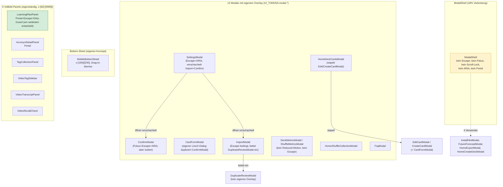

**Kernaussage des Ist-Diagramms:** Es gibt vier parallele, unverbundene „Modal-Familien" (ModalShell-Nutzer, eigenständige `UI_TOKENS`-Nachbauten, Bottom-Sheet, Vollbild-Panels) ohne gemeinsame Basis — `LearningPlanPanel` ist trotz fehlender Code-Wiederverwendung die funktional avancierteste Implementierung.

### BLATT 07 — Empfohlene Ziel-Komponentenstruktur

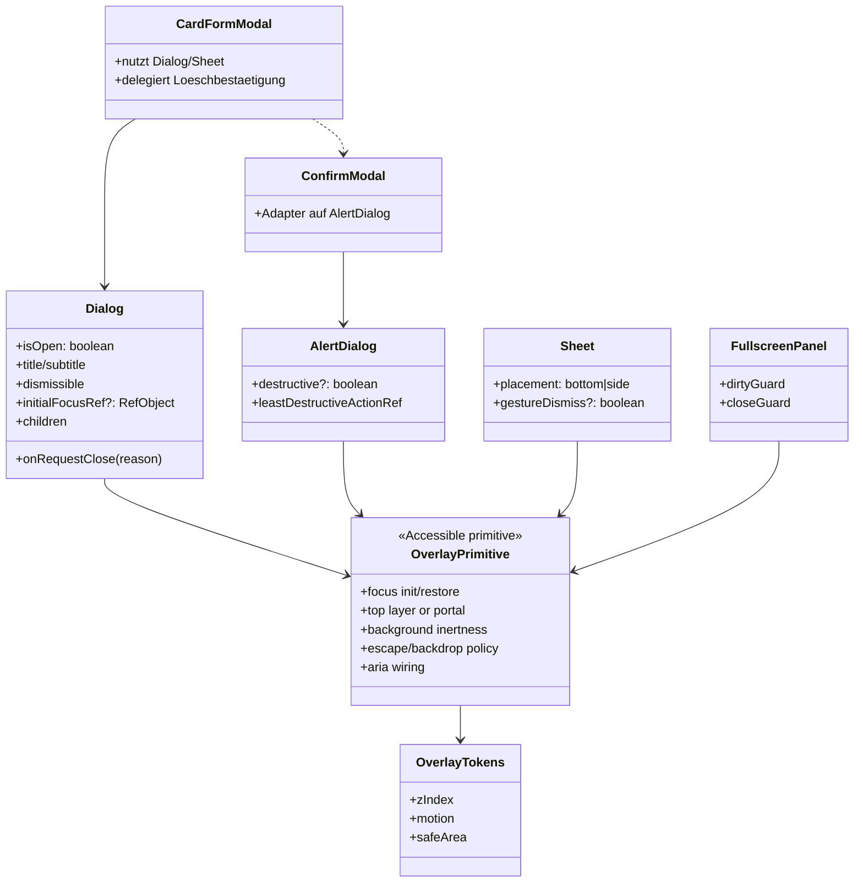

**Empfehlung:** Nicht eine immer größere `ModalShell` mit `variant: 'dialog' | 'sheet'` bauen. Dialog, AlertDialog, Mobile Sheet und FullscreenPanel haben unterschiedliche Semantik, Layoutregeln und Close-Policies. Sie sollten gemeinsame Verhaltensgrundlagen nutzen, aber getrennte öffentliche Komponenten bleiben.

Die gemeinsame Grundlage sollte möglichst auf einem etablierten Accessible-Dialog-Primitive oder dem nativen `<dialog>.showModal()`-Mechanismus beruhen. Ein eigener Fokus-Trap-/Stack-Mechanismus ist nur gerechtfertigt, wenn konkrete Produktanforderungen mit vorhandenen Primitives nicht erfüllbar sind; dann braucht er eigene Tastatur-, Screenreader-, Stacking- und Mobile-Viewport-Tests.

Empfohlene Struktur:

```text
src/ui/overlays/
├── Dialog.tsx
├── AlertDialog.tsx
├── Sheet.tsx
├── FullscreenPanel.tsx
├── OverlayHeader.tsx
├── useCloseGuard.ts
├── overlayTokens.ts
└── __tests__/
```

### BLATT 08 — Ziel-Sequenzdiagramm (Dialog öffnen/schließen)

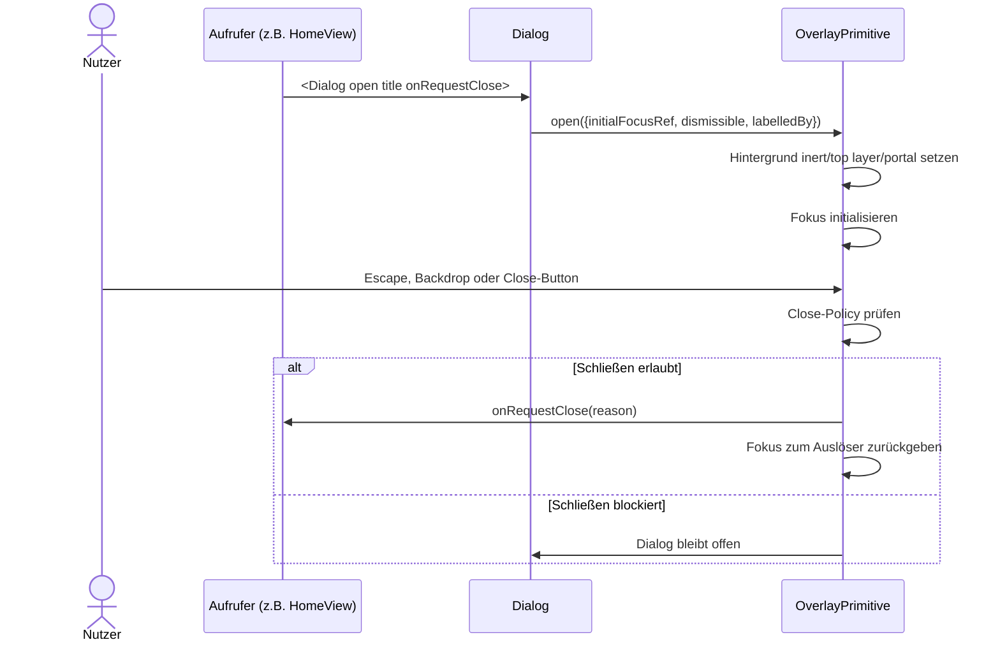

### Vorgeschlagene Props-Schnittstelle

```ts
type CloseReason =
  | 'escape'
  | 'backdrop'
  | 'close-button'
  | 'cancel'
  | 'submit'

interface DialogProps {
  open: boolean
  title: ReactNode
  description?: ReactNode
  dismissible?: boolean
  initialFocusRef?: RefObject<HTMLElement>
  onRequestClose: (reason: CloseReason) => void
  maxWidthClass?: string
  children: ReactNode
}
```

Dieser Vertrag ist bewusst aussagekräftiger als `onClose()`: Formulare können Backdrop/Escape anders behandeln als einen erfolgreichen Submit, und destruktive Dialoge können die weniger destruktive Aktion initial fokussieren. `onAfterOpen`/`onAfterClose` sollten erst ergänzt werden, wenn ein konkreter Anwendungsfall existiert; sonst erhöhen sie nur imperative Kopplung.

**Was gehört in die Overlay-Grundlage:** ARIA-Verknüpfung von Titel/Beschreibung, Fokusinitialisierung, Fokus-Rückgabe, Escape-/Backdrop-Policy, Hintergrund-Inertheit bzw. Top-Layer/Portal, Reduced-Motion-Unterstützung und zentrale Z-Index-/Safe-Area-Tokens. Scroll-Lock ist hilfreich, aber sekundär gegenüber Hintergrund-Inertheit und Fokusführung.

**Was bleibt in den konkreten Modals:** Formular-/Anzeigelogik, fachliche Validierung, DB-/Service-Aufrufe, modal-spezifisches Layout innerhalb des Bodys, Dirty-Guard-Entscheidungen und fachliche Wahl zwischen Dialog, AlertDialog, Sheet oder FullscreenPanel.

**Gemeinsame Typen:** `CloseReason`, `ConfirmDialogState`, `OverlaySize`, `SheetPlacement` und zentrale `overlayTokens`. Aktuell existieren zwei praktisch identische, aber unabhängige Ad-hoc-Confirm-States (`HomeConfirmModalState` in `useHomeViewController.ts` und das lokale `confirmModal`-Objekt in `SettingsModal.tsx:78-84`).

**Bestätigungsdialoge:** Über einen zentralen `useConfirmDialog()`-Hook, der ein einziges `ConfirmModal` pro Component-Subtree verwaltet, statt dass jede Komponente ihr eigenes `confirmModal`-State-Feld plus eigenes `<ConfirmModal .../>`-JSX pflegt.

**Verschachtelte Modals steuern:** Primär durch Produktregeln vermeiden, sekundär durch das gewählte Primitive oder einen sehr kleinen Overlay-Manager absichern. Nur das oberste Overlay darf Escape/Backdrop behandeln; verdeckte Overlays dürfen keinen Fokus erhalten.

### Migrationsreihenfolge aller vorhandenen Modals

1. **Verhaltensvertrag und Tests definieren:** Fokus nach Öffnung im Dialog, Tab/Shift+Tab verlassen den aktiven Dialog nicht, Escape trifft nur das oberste Overlay, Hintergrund ist nicht bedienbar, Fokus kehrt zum Auslöser zurück, sichtbarer Titel ist programmatisch verbunden, Reduced Motion wird berücksichtigt.
2. **Accessible Primitive auswählen oder `<dialog>`-Basis evaluieren:** Proof of Concept mit `ConfirmModal` und einem einfachen Anzeige-Dialog, inklusive Playwright-/Testing-Library-Tastaturtests.
3. **Die 4 bestehenden `ModalShell`-Verwender migrieren:** `InstallHintModal`, `FutureForecastModal`, `HomeExportModal`, `HomeCreateDeckModal`. Das validiert die Basis mit risikoarmen Fällen.
4. **Anzeige-Dialoge migrieren:** `DeckMetricsModal`, `ShuffleMetricsModal`, `FaqModal`; bei den Metrikdialogen zusätzlich gemeinsamen `MetricsDialogContent`/Periodenfilter prüfen.
5. **Confirm-Dialog-Vereinheitlichung:** `useConfirmDialog()`-Hook einführen, danach `CardFormModal`s inline-Lösch-Dialog und die getrennten `confirmModal`-States in `useHomeViewController`/`SettingsModal` darauf migrieren.
6. **Formulare und gestapelte Dialoge migrieren:** `HomeShuffleCollectionModal`, `HomeDeckCardsModal`, `ImportModal`, `SettingsModal`, `CardFormModal`. Pro Formular vorher festlegen: Backdrop erlaubt, Escape erlaubt, Dirty-Guard nötig, Initialfokus.
7. **Panels und Sheets getrennt modellieren:** `LearningPlanPanel`, Video-Panels, `AcronymDetailPanel`, `MobileBottomSheet`. `LearningPlanPanel` ist fachlich ein gutes Dirty-Guard-Vorbild, aber nicht automatisch die technische Overlay-Basis.

---

## §21 Risiken und Empfehlungen

| Priorität | Befund | Betroffene Dateien | Risiko | Empfohlene Maßnahme | Aufwand |
|---|---|---|---|---|---|
| **P0** | Sync-Mutationsvertrag ist nicht als Matrix dokumentiert; einzelne Operationen haben fachliche Sonderregeln (`deck.create` wird nicht direkt von `createDeck()` enqueued, sondern nur bei Import/Card-Erstellung bzw. bei syncbarem Inhalt berücksichtigt) | `db/queries/decks.ts:476-509`, `__tests__/db/deck-create.test.ts:67-75`, `services/syncQueue.ts:114-157`, `utils/import/importPipeline.ts:183-200` | Neue Sync-Änderungen können versehentlich leere Decks, Review-Decks oder außerhalb des Sync-Scopes liegende Daten anders behandeln als bestehende Pfade | Verbindliche Mutation-Matrix ergänzen: lokale Transaktion, Outbox/Queue-Operation, Serveroperation, Pull-Anwendung, Idempotenztest, Scope-/ReviewDeck-Regel je Mutation | Mittel |
| **P0** | App und Service Worker besitzen zwei Queue-Flush-Implementierungen: App über Dexie mit Scope-Filter und Dead-Letter-Zustand, Service Worker über rohe IndexedDB mit eigenem Retry-Code | `services/syncQueue.ts:319-401`, `public/service-worker.js:513-670`, `public/service-worker.js:892-908` | Kompatibilitätsrisiko bei Schema-/Retry-/Filteränderungen. Der aktuelle Guard delegiert bei offenen Tabs an die App, aber der SW-Eigenflush muss bei geschlossenen Tabs semantisch kompatibel bleiben | Queue-Schema und Retry-/Dead-Letter-Regeln zentral dokumentieren/testen; Integrationstest für „kein Tab offen: SW flushes queue"; bei Schemaänderungen SW/App-Kompatibilität explizit testen | Mittel |
| **P0** | Pull läuft nur nach geleertem lokalen Push-Backlog; Dead-Letter-Einträge blockieren laut Code nicht, normale fehlerhafte Einträge schon | `services/syncCoordinator.ts:33-47`, `services/syncQueue.ts:339-397`, `services/syncPull/*` | Dauerhaft fehlerhafte Operationen können Remote-Deltas verzögern, wenn sie nicht sauber in den Dead-Letter-Zustand wandern; für Lernapps kritisch, weil Reviews zeitnah konsistent sein müssen | Tests für „permanent fehlerhafte Queue-Operation blockiert Pull nicht nach Dead-Letter" und sichtbare Diagnose/Requeue/Discard-Aktion in Settings | Mittel |
| **P1** | Kein Overlay-Primitive erzwingt WAI-ARIA-Dialogverhalten; Fokusinitialisierung, Fokusbegrenzung, Fokusrückgabe und Hintergrund-Inertheit sind nicht durchgängig implementiert | Alle 22 Overlay-Komponenten, besonders `components/ModalShell.tsx:20-58` | Tastatur-/Screenreader-Nutzung ist uneinheitlich. Das ist nicht pauschal als WCAG-2.1.2-Verstoß zu formulieren; konkrete Verstöße müssen je Dialog getestet werden | Accessible Dialog/AlertDialog/Sheet/FullscreenPanel-Primitive einführen, idealerweise auf etablierter Library oder nativem `<dialog>`; Tastaturtests pro Dialogfamilie | Mittel |
| **P1** | 4 unabhängige Escape-Implementierungen, 18 Komponenten ganz ohne Escape | `ConfirmModal`, `SettingsModal`, `ImportModal`, `LearningPlanPanel` vs. Rest | Inkonsistentes, für Nutzer unvorhersagbares Verhalten je Modal | Escape-/Backdrop-Policy in der Overlay-Grundlage verankern; `onRequestClose(reason)` statt reinem `onClose()` verwenden | Mittel |
| **P1** | Uneinheitliche z-Index-Werte (`60…9999`) ohne zentrale Skala | Projektweit (§3.10 Punkt 1) | Reales Stacking-Risiko: Dropdown-Menüs (`1100`/`1300`) liegen über regulären Modals (`1000`) | Zentrale `overlayTokens`/`UI_TOKENS.zIndex` einführen und Dropdown/Overlay/Toast/Splash systematisch staffeln | Niedrig |
| **P1** | `CardFormModal` dupliziert `ConfirmModal` für die Kartenlöschung statt es zu verwenden | `components/CardFormModal.tsx:709-744` | Divergenz zwischen zwei „gleichen" Bestätigungsdialogen bei künftigen Änderungen (z. B. Barrierefreiheit nur an einer Stelle nachgezogen) | Inline-Dialog durch zentralen `ConfirmModal`/`AlertDialog` ersetzen | Niedrig |
| **P2** | Direkter `db.decks`-Zugriff aus `CardFormModal` statt Query-Funktion | `components/CardFormModal.tsx:81` | Umgeht die Query-Schicht, erschwert künftige Änderungen an der Deck-Lese-Logik (z. B. Soft-Delete-Filter) | Auf eine Query-Funktion wie `listDecks()`/dedizierte Deck-Options-Query umstellen | Niedrig |
| **P2** | Dexie-`liveQuery` und globale `REVIEW_UPDATED_EVENT`-Refreshes existieren parallel | `hooks/useCardDb.ts:71-188`, `db/queries/reviews.ts:36-43`, `hooks/useStreak.ts:51`, `hooks/useHeatmap.ts:121`, `hooks/home/useLearningUnits.ts:424` | Doppelte Invalidierung und schwer nachvollziehbare Aktualisierungspfade | Regel festlegen: persistente DB-Änderungen primär über `liveQuery`/Query-Revision, Browserereignisse nur für nicht persistente oder bewusst aggregierte Refresh-Signale | Mittel |
| **P2** | Vier Reduced-Motion-Ausnahmen (`DeckMetricsModal`, `ShuffleMetricsModal`, `HomeDeckCardsModal`, `MobileBottomSheet`) | Genannte Dateien | Nutzer mit `prefers-reduced-motion` sehen dort weiterhin Bewegungsanimationen | `useReducedMotion()` ergänzen oder Bewegung über Overlay-Primitive zentral reduzieren | Niedrig |
| **Niedrig** | Generische, wenig aussagekräftige `AI_CONTEXT`-Kopfkommentare bei mehreren Modals | `InstallHintModal.tsx`, `FutureForecastModal.tsx`, `DeckMetricsModal.tsx`, `FaqModal.tsx`, `ShuffleMetricsModal.tsx` | Rein dokumentarisch, kein funktionales Risiko | Bei nächster inhaltlicher Änderung durch spezifischen Kommentar ersetzen | Niedrig |
| **Niedrig** | `getMigrationLog()` sicher ungenutzt | `services/algorithmMigration.ts:214` | Totes Exportiertes ohne funktionale Auswirkung | Entfernen oder in Diagnose-UI (`SettingsDataSection`) anzeigen | Niedrig |
| **Niedrig** | Namenskonventions-Abweichungen (`normalizeDueDates`, `get*` auf localStorage-Basis, `list*` für Netzwerkaufrufe) | `db/queries/cards.ts`, `diagnostics.ts`, `services/profileService.ts` (§15) | Erschwert Lesbarkeit/Vorhersagbarkeit für neue Entwickler, kein Laufzeitrisiko | Bei nächster Berührung dieser Funktionen umbenennen | Niedrig |

**Ist-Zustand vs. Empfehlung:** Die Modal-/Overlay-Landschaft bleibt eine deutliche Frontend-Schwäche. Für eine Offline-first-Lernapp ist die höchste Architekturpriorität aber Datenintegrität: Review-, Karten-, Deck-, VideoNote- und ExamDate-Mutationen müssen lokal, in der Queue, serverseitig und im Pull konsistent bleiben. Die UI-Overlay-Arbeit sollte deshalb parallel, aber nicht vor Sync-/Service-Worker-Verifikation priorisiert werden.

---

## §22 Zusammenfassung

**Aktuelle Architektur:** Card_PWA ist eine React/TypeScript-PWA ohne Router und ohne globales State-Management-Framework; Navigation läuft über eine manuelle View-State-Machine (`useAppNavigation`), Zustand ist auf lokalen Component-State, zwei React-Contexts, mehrere Controller-Hooks und — architektonisch am gewichtigsten — die Dexie/IndexedDB-Datenbank selbst als reaktiven Store (`liveQuery`) verteilt. Die Datenschicht ist sauber in Dexie-Definition (`db/index.ts`, 21 Versionsschritte mit dokumentierten Migrationen), Query-Module (14 Dateien, überwiegend konventionstreu benannt) und Service-Schicht (Sync-Coordinator/Queue/Pull, Lerneinheiten-Runner, Profil-Service mit 12 Auth-Endpunkten) gegliedert.

**Wichtigste Stärken:** durchgängige `AI_CONTEXT`-Dokumentation nahezu jeder Datei; eine ernsthaft durchdachte, dokumentierte Dexie-Versionshistorie inklusive sauber abgeschlossener Migrationen (Branding, `videoNotes`→`videoNotes2`, Index-Pruning in v16); ein robustes, mehrschichtiges Sync-Protokoll (Handshake→Bootstrap/Snapshot→Delta-Pull, Reps-First-Konfliktregel, transaktionale Outbox) das Datenverlust bei Abstürzen aktiv verhindert; konsequente Web-Worker-Auslagerung rechenintensiver Aufgaben mit einheitlichem Fallback-Muster (`workerPool.ts`); ein durchdachtes „Heute-Paket"/Lerneinheiten-System, das mehrere Lernmodalitäten (Karten, Video, Labs, Akronyme) additiv integriert, ohne den Kernbestand anzutasten.

**Wichtigste Schwächen:** Für die Gesamtarchitektur sind die größten Risiken nicht kosmetisch, sondern datenbezogen: Der Sync-Mutationsvertrag ist nicht als prüfbare Matrix dokumentiert, App und Service Worker besitzen zwei Queue-Flush-Implementierungen, und Pull-Deltas hängen bewusst davon ab, dass der lokale Push-Backlog geleert ist. Im Frontend bleibt zusätzlich die Modal-/Overlay-Landschaft auffällig schwach: 22 strukturell ähnliche Overlay-Komponenten ohne gemeinsame Verhaltensbasis, uneinheitliches Escape-/Fokus-/Scroll-Lock-/ARIA-Verhalten, eine chaotische z-Index-Skala (60 bis 9999) und mehrfach duplizierte Bestätigungsdialog-Logik. Daneben steht ein „God Hook" (`useHomeViewController`, 21 State-Felder/30 Handler).

**Zentrale Rolle oder tatsächliche Nebenrolle von `ModalShell`:** Nachweislich eine **Nebenrolle**. `ModalShell` wird nur von 4 der 22 Overlay-Komponenten verwendet (≈18 %), bietet keine der in einem professionellen Dialog-System erwarteten Verhaltensgarantien (Fokus-Trap, Escape, Scroll-Lock, ARIA) und wurde von den übrigen 18 Komponenten unabhängig und uneinheitlich nachgebaut statt erweitert. Die eigentliche projektweite Vereinheitlichung erfolgt nicht über eine Komponente, sondern über gemeinsame CSS-Klassen (`UI_TOKENS.modal.*`), die naturgemäß kein Verhalten erzwingen können.

**Größte technische Risiken:** Datenintegrität und Sync-Kompatibilität stehen vor UI-Kosmetik: Mutationstypen, Queue-/Outbox-Verhalten, Service-Worker-Eigenflush und Pull-nach-Push müssen als Vertrag getestet werden. Bei den Overlays sind fehlendes durchgängiges Fokusmanagement, Hintergrund-Inertheit, ARIA-Verknüpfung und z-Index-Staffelung die wichtigsten Frontend-Risiken.

**Empfohlene nächste Schritte:** (1) Sync-Mutationsmatrix für alle lokalen Mutationen erstellen und mit Tests gegen Queue, Server-Push, Pull-Anwendung und Idempotenz absichern; (2) Service-Worker-Queue-Flush gegen App-Queue-Flush testen und Retry-/Dead-Letter-Regeln angleichen oder explizit dokumentieren; (3) Pull-Blockade durch fehlerhafte Queue-Einträge per Integrationstest absichern; (4) ein Accessible Overlay-Primitive für Dialog/AlertDialog/Sheet/FullscreenPanel auswählen und mit Tastaturtests einführen; (5) danach die vier aktuellen `ModalShell`-Nutzer und anschließend Anzeige-/Formular-Dialoge migrieren.
